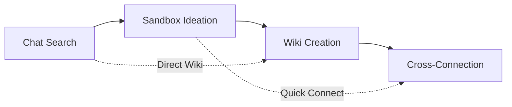

# /shelet-brainstorm - Prompt Chain Knowledge Development System

## Purpose
Multi-stage prompt chain: Search chat database → Generate ideas in sandbox → Structure in wiki → Connect concepts. Transforms chat insights into crystallized, interconnected knowledge using SHELET compression across your entire knowledge ecosystem.

## Supabase Access
```yaml
Project: Sparkii
Project ID: ppxclcyrnuactlfhmchm
Access Method: Supabase MCP

MCP Tool Commands:
- mcp__supabase_sparkii__list_tables         # View all tables
- mcp__supabase_sparkii__execute_sql         # Query data
- mcp__supabase_sparkii__list_projects       # Verify project
- mcp__supabase_sparkii__get_project         # Get project details

Data Available:
- 11,270 AI Chat Histories (clean_chat_histories)
  - 4,748 ChatGPT Desktop conversations
  - 3,037 Claude Code sessions
  - 2,618 Claude Desktop conversations
  - 867 Gemini AI conversations
- Temporal Range: May 2023 - September 2025
- Average messages: 10-24 per conversation
```

## Database Tables

### `public.clean_chat_histories` - All Chat Histories
**Purpose**: Centralized storage for all AI conversations (migrated from raw_content_unified)
```
Key Columns:
- id: UUID primary key  
- conversation_id: Unique conversation identifier
- title: Conversation title
- source_type: 'chatgpt-desktop', 'claude-code', 'claude-desktop', 'gemini-ai'
- ai_source: 'chatgpt', 'claude', 'gemini'
- content: JSONB with full conversation data
- messages: JSONB array of messages
- total_messages: Message count
- occurred_at: When conversation happened
- metadata: Additional context
- search_vector: Full-text search
```

### Note: MordeLens Analysis
The `mordelens` table previously used for multi-perspective analysis is currently empty. Analysis features may be reimplemented against the clean_chat_histories table.

## 🔄 Prompt Chain Architecture



### Directory Structure
```yaml
Chat_Database:
  project_id: "ppxclcyrnuactlfhmchm"
  tables: ["raw_content_unified", "mordelens"]
  
Sandbox_Development:
  path: "/Users/mordechai/Sparkii/sparkii-command-center/Sparkii/sandbox/"
  format: "[YYYY-MM-DD]_[concept]_sandbox.md"
  purpose: "Raw idea development and experimentation"

Wiki_Knowledge:
  path: "/Users/mordechai/Sparkii/sparkii-command-center/Sparkii/wiki/"
  format: "[CONCEPT]_wiki.md"
  purpose: "Structured, crystallized knowledge"

Connection_Map:
  file: "/Users/mordechai/Sparkii/sparkii-command-center/Sparkii/wiki/_connections.md"
  purpose: "Knowledge graph relationships"
```

## 🎯 Command Structure

### Stage 1: Chat Database Search
```bash
/shelet-brainstorm --search "query"              # Basic search
/shelet-brainstorm --search "query" --quality    # High-value conversations only
/shelet-brainstorm --search "query" --business   # Business/revenue focus
/shelet-brainstorm --search "query" --technical  # Technical discussions
```

### Stage 2: Sandbox Idea Generation  
```bash
/shelet-brainstorm --sandbox "concept"           # Create new sandbox file
/shelet-brainstorm --sandbox "concept" --from-search  # Use last search results
/shelet-brainstorm --sandbox-list                # Show all sandbox files
/shelet-brainstorm --sandbox-review "file"       # Review sandbox for wiki promotion
```

### Stage 3: Wiki Knowledge Creation
```bash
/shelet-brainstorm --wiki "topic"                # Create new wiki entry
/shelet-brainstorm --wiki "topic" --from-sandbox # Promote sandbox to wiki
/shelet-brainstorm --wiki-list                   # Show all wiki entries
/shelet-brainstorm --wiki-update "topic"         # Update existing wiki
```

### Stage 4: Cross-Connection Discovery
```bash
/shelet-brainstorm --connect "wiki1" "wiki2"     # Manual connection
/shelet-brainstorm --connect-auto "wiki"         # Auto-find connections
/shelet-brainstorm --connect-map                 # Show full connection map
/shelet-brainstorm --connect-analyze             # Analyze connection strength
```

### Full Chain Commands
```bash
/shelet-brainstorm --chain "query"               # Full pipeline: search → sandbox → wiki
/shelet-brainstorm --quick "query"               # Fast: search → sandbox
/shelet-brainstorm --deep "concept"              # Develop: sandbox → wiki → connect
```

### Utility Commands
```bash
/shelet-brainstorm --stats                       # Database statistics
/shelet-brainstorm --session-log                 # Current session summary
/shelet-brainstorm --cleanup                     # Organize sandbox/wiki files
/shelet-brainstorm --help                        # Show usage guide
```

## 🔍 Stage 1: Chat Database Search Behavior

### Search Operations
```yaml
Basic Search (--search):
  1. Query chat database using full-text search
  2. Return relevance-ranked results  
  3. Show temporal patterns and source distribution
  4. Extract key concepts and themes
  5. Prepare for sandbox development

Quality Focus (--search + --quality):
  1. Filter for high actionability/knowledge scores
  2. Prioritize problem-solving conversations
  3. Show effectiveness metrics
  4. Identify best learning examples

Business Focus (--search + --business):
  1. Filter for revenue/business-related discussions
  2. Extract monetization patterns
  3. Identify venture opportunities
  4. Show financial impact discussions

Technical Focus (--search + --technical):
  1. Filter for implementation/architecture discussions
  2. Extract technical patterns and solutions
  3. Identify development frameworks
  4. Show debugging/optimization insights
```

### Search Output Format
```markdown
# 🔍 Chat Search: "[query]"

## 📊 Search Results
- **Matches Found**: [count]
- **Relevance Range**: [min-max scores]  
- **Time Span**: [earliest to latest]
- **Primary Sources**: [conversation types]

## 🎯 Top Conversations
| Title | Messages | Source | Date | Relevance |
|-------|----------|--------|------|-----------|
| [title] | [count] | [type] | [date] | [score] |

## 🧩 Extracted Concepts
1. **[Concept A]** - appears in [X] conversations
2. **[Concept B]** - evolving pattern over [timespan]  
3. **[Concept C]** - connected to [other themes]

## 🚀 Sandbox Development Candidates
Ready for ideation:
- **[Best Concept]** - [development potential]
- **[Revenue Opportunity]** - [business potential]
- **[Technical Pattern]** - [implementation potential]

**Next Stage**: `/shelet-brainstorm --sandbox "[selected_concept]" --from-search`
```

## 🌱 Stage 2: Sandbox Idea Generation

### Sandbox Operations
```yaml
Create New (--sandbox):
  1. Generate timestamped sandbox file
  2. Apply SHELET 4-phase development framework
  3. Include business opportunity analysis
  4. Map connections to existing knowledge
  5. Assess wiki promotion readiness

From Search (--sandbox + --from-search):
  1. Use last search results as input
  2. Focus on highest-potential concepts
  3. Include chat evidence and patterns
  4. Develop comprehensive framework
  5. Generate revenue crystallization

Review for Promotion (--sandbox-review):
  1. Assess sandbox file maturity
  2. Evaluate business validation
  3. Check implementation readiness  
  4. Score wiki promotion criteria
  5. Recommend next development stage
```

### Sandbox File Template
Creates: `/Sparkii/sandbox/[YYYY-MM-DD]_[concept]_sandbox.md`

```markdown
# [CONCEPT] - Sandbox Development
*Generated: [timestamp] | Source: [search_query/manual]*

## 🧩 SHELET Development Framework

### Phase 1: Infinite → Focused (Chat Reality → Concrete Scope)
- **Chat Evidence**: [conversations and patterns that led here]
- **Infinite Possibilities**: [all directions this could go]  
- **Focus Selection**: [chosen development direction]
- **Concrete Scope**: [specific boundaries for development]

### Phase 2: Focused → Structured (Concrete → Organizing Principles)
- **Raw Concepts**: [unorganized ideas and insights]
- **Pattern Recognition**: [underlying structures identified]
- **Framework Emergence**: [organizing principles discovered]
- **Validation Criteria**: [how to test these patterns]

### Phase 3: Structured → Core (Principles → 5 Essential Elements)
1. **[CORE_ELEMENT_1]**: [definition + why essential]
2. **[CORE_ELEMENT_2]**: [definition + relationship to #1]
3. **[CORE_ELEMENT_3]**: [definition + unique contribution]
4. **[CORE_ELEMENT_4]**: [definition + implementation method]
5. **[CORE_ELEMENT_5]**: [definition + amplification trigger]

### Phase 4: Core → Infinite (5 Elements → Unlimited Applications)
- **Business Applications**: [revenue multiplication paths]
- **Venture Integration**: [how this enhances existing businesses]
- **Framework Extensions**: [how this becomes methodology]
- **Sovereignty Preservation**: [how this maintains full agency]

## 💰 Revenue Crystallization
### Business Development Pipeline
```yaml
Immediate_Opportunities: [1-4 weeks to revenue]
  - application: [specific business application]
  - revenue_model: [how money flows]
  - implementation_effort: [time/resources needed]

Strategic_Opportunities: [1-4 months to scale]  
  - venture_enhancement: [how this improves existing businesses]
  - new_venture_potential: [standalone business possibility]
  - partnership_opportunities: [collaboration potential]

Multiplicative_Opportunities: [1-4 quarters to exponential]
  - cross_venture_synergy: [how this amplifies all ventures]
  - framework_licensing: [how this becomes methodology]
  - sovereignty_amplification: [how this increases personal agency]
```

## 🎓 Wiki Promotion Assessment
### Maturity Checklist
- [ ] **Concept Crystallized**: Clear definition and boundaries
- [ ] **Business Validated**: Revenue model identified and tested
- [ ] **Implementation Mapped**: Development approach outlined  
- [ ] **Connections Identified**: Relationships to other concepts
- [ ] **Sovereignty Verified**: Agency preservation confirmed

### Promotion Score
```python
promotion_readiness = (
    concept_clarity * 0.25 +        # 0-10 scale
    business_validation * 0.30 +    # 0-10 scale  
    implementation_plan * 0.20 +    # 0-10 scale
    connection_potential * 0.15 +   # 0-10 scale
    sovereignty_score * 0.10        # 0-10 scale
)
# Promote to wiki when score > 7.0
```

**Status**: [DEVELOPING/READY_FOR_WIKI/NEEDS_REFINEMENT]
```

## 🏛️ Stage 3: Wiki Knowledge Structuring

### Wiki Operations  
```yaml
Create New (--wiki):
  1. Generate structured wiki entry
  2. Include business integration matrix
  3. Map venture connections
  4. Create knowledge graph links
  5. Add to connection map

From Sandbox (--wiki + --from-sandbox):
  1. Promote mature sandbox content
  2. Restructure for wiki format
  3. Add formal business analysis
  4. Create bidirectional links
  5. Archive source sandbox file

Update Existing (--wiki-update):
  1. Enhance existing wiki entry
  2. Merge new insights from recent chats
  3. Update business integration status
  4. Refresh connection mappings
  5. Version track changes
```

## 🔗 Stage 4: Cross-Connection Intelligence

### Connection Discovery
```yaml
Manual Connection (--connect):
  1. Analyze relationship between two wikis
  2. Calculate synergy score and type
  3. Generate business impact assessment
  4. Create bidirectional links
  5. Update connection map

Auto-Discovery (--connect-auto):
  1. Scan all wikis for concept overlap
  2. Calculate connection strengths
  3. Identify unexpected synergies
  4. Suggest high-value connections
  5. Generate connection recommendations

Connection Analysis (--connect-analyze):
  1. Audit existing connections
  2. Find orphaned concepts
  3. Identify strongest networks
  4. Recommend strategic connections
  5. Calculate network value
```

## Core Queries for Chat History Exploration

### How to Execute Queries
```yaml
Tool: mcp__supabase_sparkii__execute_sql
Parameters:
  project_id: "ppxclcyrnuactlfhmchm"
  query: "YOUR SQL QUERY HERE"
```

### Essential Queries

```yaml
# 1. Search conversations by keyword/topic
mcp__supabase_sparkii__execute_sql:
  project_id: "ppxclcyrnuactlfhmchm"
  query: |
    SELECT 
      conversation_id as conv_id,
      title,
      total_messages as message_count,
      source_type,
      ai_source,
      occurred_at
    FROM public.clean_chat_histories
    WHERE (content::text ILIKE '%KEYWORD%' OR title ILIKE '%KEYWORD%')
    ORDER BY occurred_at DESC
    LIMIT 20

# 2. Find patterns across conversations
mcp__supabase_sparkii__execute_sql:
  project_id: "ppxclcyrnuactlfhmchm"
  query: |
    SELECT 
      title,
      conversation_id as conv_id,
      source_type,
      ai_source,
      total_messages as messages,
      occurred_at
    FROM public.clean_chat_histories
    WHERE (content::text ILIKE '%pattern1%' AND content::text ILIKE '%pattern2%')
    ORDER BY total_messages DESC
    LIMIT 30

# 3. Get conversations with most messages (proxy for quality/depth)
mcp__supabase_sparkii__execute_sql:
  project_id: "ppxclcyrnuactlfhmchm"
  query: |
    SELECT 
      conversation_id,
      title,
      source_type,
      ai_source,
      total_messages,
      occurred_at
    FROM public.clean_chat_histories
    WHERE total_messages > 30
    ORDER BY total_messages DESC
    LIMIT 20

# 4. Conversation statistics by source
mcp__supabase_sparkii__execute_sql:
  project_id: "ppxclcyrnuactlfhmchm"
  query: |
    SELECT 
      source_type,
      ai_source,
      COUNT(*) as total_conversations,
      AVG(total_messages) as avg_messages,
      MAX(total_messages) as max_messages,
      MIN(occurred_at) as earliest,
      MAX(occurred_at) as latest
    FROM public.clean_chat_histories
    GROUP BY source_type, ai_source
    ORDER BY total_conversations DESC

# 5. Find conversations by time period
mcp__supabase_sparkii__execute_sql:
  project_id: "ppxclcyrnuactlfhmchm"
  query: |
    SELECT 
      title,
      conversation_id as conv_id,
      source_type,
      ai_source,
      occurred_at,
      total_messages as messages
    FROM public.clean_chat_histories
    WHERE occurred_at BETWEEN 'START_DATE' AND 'END_DATE'
    ORDER BY occurred_at DESC

# 6. Extract conversation topics
mcp__supabase_sparkii__execute_sql:
  project_id: "ppxclcyrnuactlfhmchm"  
  query: |
    SELECT 
      title,
      COUNT(*) OVER (PARTITION BY title) as title_frequency,
      source_type,
      ai_source,
      total_messages as message_count
    FROM public.clean_chat_histories
    WHERE title IS NOT NULL
    ORDER BY title_frequency DESC
    LIMIT 50

# 7. Find longest/most complex conversations
mcp__supabase_sparkii__execute_sql:
  project_id: "ppxclcyrnuactlfhmchm"
  query: |
    SELECT 
      title,
      conversation_id as conv_id,
      total_messages as message_count,
      source_type,
      ai_source,
      occurred_at
    FROM public.clean_chat_histories
    WHERE total_messages IS NOT NULL
    ORDER BY total_messages DESC
    LIMIT 20

# 8. Analyze conversation distribution by AI source
mcp__supabase_sparkii__execute_sql:
  project_id: "ppxclcyrnuactlfhmchm"
  query: |
    SELECT 
      ai_source,
      COUNT(*) as total_conversations,
      AVG(total_messages) as avg_messages,
      SUM(total_messages) as total_messages_exchanged,
      ROUND(COUNT(*)::numeric * 100.0 / SUM(COUNT(*)) OVER (), 2) as percentage
    FROM public.clean_chat_histories
    GROUP BY ai_source
    ORDER BY total_conversations DESC

# 9. Find conversations with specific topics in title
mcp__supabase_sparkii__execute_sql:
  project_id: "ppxclcyrnuactlfhmchm"
  query: |
    SELECT 
      conversation_id,
      title,
      source_type,
      ai_source,
      total_messages,
      occurred_at
    FROM public.clean_chat_histories
    WHERE title ILIKE '%TOPIC%'
    ORDER BY occurred_at DESC
    LIMIT 30

# 10. Get conversation message samples
mcp__supabase_sparkii__execute_sql:
  project_id: "ppxclcyrnuactlfhmchm"
  query: |
    SELECT 
      conversation_id as conv_id,
      title,
      messages->0->>'content' as first_message,
      messages->(total_messages-1)->>'content' as last_message,
      source_type,
      ai_source
    FROM public.clean_chat_histories
    WHERE messages IS NOT NULL
    AND total_messages > 0
    LIMIT 10
```

## Response Format
All responses will be:
- **Data-driven** - Based on actual chat histories
- **Insightful** - Extract meaningful patterns
- **Actionable** - Provide useful findings
- **Contextual** - Show temporal and thematic relationships
- **Statistical** - Include relevant metrics

## Example Outputs

### Example 1: `/shelet-brainstorm --search "API integration"`
"Found 47 conversations about API integration:
- Peak period: March-April 2024 (28 conversations)
- Average complexity: 45 messages per conversation
- Sources: ChatGPT (22), Claude (18), Gemini (7)
- Most relevant: 'Building Stripe Integration' (85 messages)"

### Example 2: `/shelet-brainstorm --stats`
"Chat History Statistics from 11,270 conversations:
- ChatGPT Desktop: 4,748 conversations (avg 24 messages)
- Claude Code: 3,037 sessions
- Claude Desktop: 2,618 conversations (avg 10 messages)
- Gemini AI: 867 conversations
- Date Range: May 2023 - September 2025"

### Example 3: Full Chain Development
```bash
/shelet-brainstorm --chain "API automation patterns"
```
**Output**: 
1. **Search Results**: 34 conversations about API automation
2. **Sandbox Created**: `2025-09-04_API_Automation_Framework_sandbox.md`
3. **Key Insight**: Pattern of manual → automated → AI-enhanced progression
4. **Wiki Readiness**: 8.2/10 - ready for promotion
5. **Next Step**: `/shelet-brainstorm --wiki "API_Automation_Framework" --from-sandbox`

## 💾 Session Management & State Persistence

### Session Tracking
Each brainstorm session maintains state across commands:
```yaml
Session_State:
  last_search: "[query and results]"
  active_sandbox_files: ["file1", "file2"]
  wiki_promotion_queue: ["concept1", "concept2"]
  pending_connections: [("wiki_a", "wiki_b", strength)]
  session_insights: ["insight1", "insight2"]

Session_Log: "/claudedocs/brainstorm_session_[timestamp].md"
  - Commands executed in sequence
  - Files created/updated
  - Connections discovered
  - Business opportunities identified
  - Next session preparation
```

### Cross-Session Intelligence
```yaml
Knowledge_Evolution:
  - Track concept development across sessions
  - Identify recurring exploration patterns
  - Measure knowledge network growth
  - Monitor business opportunity progression

Pipeline_Management:
  - Sandbox → Wiki promotion pipeline
  - Wiki → Connection discovery pipeline  
  - Connection → Business opportunity pipeline
  - Opportunity → Implementation pipeline
```

## Additional Useful Queries for Clean Data

```yaml
# 11. Search across all Claude conversations
mcp__supabase_sparkii__execute_sql:
  project_id: "ppxclcyrnuactlfhmchm"
  query: |
    SELECT 
      conversation_id,
      title,
      source_type,
      total_messages,
      occurred_at
    FROM public.clean_chat_histories
    WHERE ai_source = 'claude'
    AND (content::text ILIKE '%KEYWORD%' OR title ILIKE '%KEYWORD%')
    ORDER BY occurred_at DESC
    LIMIT 30

# 12. Find recent high-engagement conversations
mcp__supabase_sparkii__execute_sql:
  project_id: "ppxclcyrnuactlfhmchm"
  query: |
    SELECT 
      conversation_id,
      title,
      source_type,
      ai_source,
      total_messages,
      occurred_at
    FROM public.clean_chat_histories
    WHERE occurred_at > CURRENT_DATE - INTERVAL '30 days'
    AND total_messages > 20
    ORDER BY total_messages DESC, occurred_at DESC
    LIMIT 50

# 13. Temporal distribution analysis
mcp__supabase_sparkii__execute_sql:
  project_id: "ppxclcyrnuactlfhmchm"
  query: |
    SELECT 
      DATE_TRUNC('month', occurred_at) as month,
      ai_source,
      COUNT(*) as conversations,
      AVG(total_messages) as avg_messages
    FROM public.clean_chat_histories
    GROUP BY month, ai_source
    ORDER BY month DESC, conversations DESC

# 14. Cross-AI comparison for topic
mcp__supabase_sparkii__execute_sql:
  project_id: "ppxclcyrnuactlfhmchm"
  query: |
    SELECT 
      ai_source,
      COUNT(*) as count,
      AVG(total_messages) as avg_messages,
      STRING_AGG(DISTINCT source_type, ', ') as platforms
    FROM public.clean_chat_histories
    WHERE content::text ILIKE '%TOPIC%'
    GROUP BY ai_source
    ORDER BY count DESC
```

## 🎯 The Pashut Truth

This is **sovereignty amplification through crystallized intelligence**. Every chat insight becomes:

1. **Searchable** (in your database)
2. **Developable** (through sandbox experimentation)
3. **Structured** (via wiki crystallization)
4. **Connected** (through knowledge graph)
5. **Amplifiable** (into infinite business applications)

The bottleneck (scattered insights across 9,064+ chats) IS the amplifier (systematic crystallization into multiplying knowledge network).

## 🚀 Key Focus Areas
- Transform chat history into structured knowledge assets
- Identify cross-conversation patterns and evolution
- Generate business opportunities from discussion insights  
- Build interconnected wiki knowledge network
- Preserve sovereignty while amplifying intelligence
- Create actionable frameworks from scattered thoughts

## Auto-Save Implementation (`--makemd`)

### File Generation Process
When `--makemd` flag is used:

1. **Execute Analysis**: Run the requested brainstorm operation
2. **Generate Timestamp**: Create ISO timestamp (YYYY-MM-DD-HHMMSS)
3. **Sanitize Title**: Clean topic/title for filename compatibility
4. **Create Markdown File**: Save to `/Users/mordechai/Sparkii/sparkii-command-center/Sparkii/`

### Markdown Template
```markdown
# 🧠 Brainstorm Session: {TITLE}

**Session Date**: {TIMESTAMP}  
**Query Type**: {--search|--analyze|--insights|--patterns|--quality|--stats}  
**Query**: {USER_INPUT}

## 📊 Key Findings

{ANALYSIS_RESULTS}

## 💡 Insights Extracted

{INSIGHTS_AND_PATTERNS}

## 📈 Statistics

{RELEVANT_METRICS}

## 🎯 Actionable Items

{ACTIONABLE_INSIGHTS}

## 🔗 Related Conversations

{CONVERSATION_REFERENCES}

---
*Generated by Sparkii Brainstorm Explorer*  
*Session ID: {SESSION_HASH}*
```

### Implementation Logic
```yaml
Auto-Save Trigger:
  - Any brainstorm command with --makemd flag
  - Executes normal brainstorm operation first
  - Then creates timestamped markdown file

Filename Convention:
  - Format: "brainstorm-{YYYY-MM-DD-HHMMSS}-{topic}.md"
  - Example: "brainstorm-2025-09-04-143022-api-integration-patterns.md"
  - Sanitization: Replace spaces with hyphens, remove special chars

Content Structure:
  - Header with session metadata
  - Analysis results formatted for future reference
  - Actionable insights highlighted
  - References to specific conversations with IDs
  - Session hash for tracking

Error Handling:
  - If file creation fails, display error but complete brainstorm
  - If Sparkii folder doesn't exist, create it
  - Unique filename generation to prevent overwrites
```

## 🎯 Workflow Examples

### Daily Knowledge Development
```bash
# Morning knowledge harvest
/shelet-brainstorm --search "yesterday insights" --quality
/shelet-brainstorm --sandbox "best_insight_from_search" --from-search

# During hyperfocus sessions
/shelet-brainstorm --wiki "current_focus_topic" 
/shelet-brainstorm --connect-auto "new_wiki_entry"
```

### Business Opportunity Discovery  
```bash
# Revenue pattern mining
/shelet-brainstorm --search "revenue opportunities" --business
/shelet-brainstorm --sandbox "highest_revenue_concept" --from-search
/shelet-brainstorm --wiki "Revenue_Framework" --from-sandbox
/shelet-brainstorm --connect "Revenue_Framework" "WOTCFY_Platform"
```

### Cross-Venture Innovation
```bash
# Venture synergy exploration
/shelet-brainstorm --search "integration opportunities"
/shelet-brainstorm --deep "venture_synergy_concept"
/shelet-brainstorm --connect-analyze  # Find all cross-venture connections
```

### Knowledge Synthesis Sessions
```bash
# Weekly knowledge compilation
/shelet-brainstorm --search "week's breakthroughs"
/shelet-brainstorm --chain "synthesis_opportunities"
/shelet-brainstorm --connect-map  # Review full knowledge network
```

### Quick Development Cycles
```bash
# Fast concept development
/shelet-brainstorm --quick "emerging_pattern"  # search → sandbox
/shelet-brainstorm --sandbox-review "latest_sandbox"  # assess readiness
/shelet-brainstorm --wiki "mature_concept" --from-sandbox  # promote when ready
```