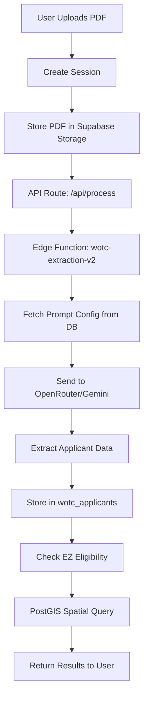

#wotcfy
#shadcn
#supabase
#postgis
#openrouter
#Nextjs
#vercel
#jsonb
# 🔍 WOTCFY-SH Application Technical Analysis Report

## Executive Summary
WOTCFY-SH is a sophisticated Work Opportunity Tax Credit (WOTC) processing application built with Next.js 14, Supabase, and OpenRouter AI integration. The application leverages Edge Functions and AI models (specifically Google Gemini 2.5 Flash) for intelligent PDF document extraction and processing, combined with PostGIS spatial analysis for Empowerment Zone eligibility verification.

---

## 🏗️ Architecture Overview

### Tech Stack
- **Frontend**: Next.js 14 (App Router), React 18, TypeScript 5
- **UI Framework**: shadcn/ui components with Radix UI primitives
- **Styling**: Tailwind CSS 3.4 with custom animations
- **Backend**: Supabase (PostgreSQL with PostGIS extension)
- **AI Integration**: OpenRouter API (Google Gemini 2.5 Flash)
- **Edge Functions**: Deno-based Supabase Edge Functions
- **Authentication**: Supabase Auth with SSR support
- **File Storage**: Supabase Storage (public bucket for PDFs)

---

## 🤖 AI Integration Pattern

### 1. OpenRouter Configuration
The app uses OpenRouter as an AI gateway, specifically leveraging Google Gemini models:

```typescript
// Environment Variables
OPENROUTER_API_KEY: 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
```

### 2. Processing Flow

#### Step 1: API Route Handler (`/api/process/route.ts`)
```typescript
POST /api/process
│
├── Receives: { sessionId, filePath }
├── Updates session status to 'processing'
├── Creates public URL for uploaded PDF
└── Calls Edge Function with file URL
```

**Key Features:**
- Session tracking with JSONB pipeline status
- Device info capture for analytics
- Processing metrics (timing, cache status)
- Error handling with detailed pipeline tracking

#### Step 2: Edge Function (`wotc-extraction-v2`)
```typescript
Edge Function Architecture:
│
├── Prompt Configuration (Database-Driven)
│   ├── Fetches from 'prompts' table
│   ├── Dynamic model selection
│   └── Configurable temperature/tokens
│
├── PDF Processing
│   ├── Downloads PDF from Supabase Storage
│   ├── Converts to Base64
│   └── Sends to OpenRouter API
│
└── AI Extraction (Gemini 2.5 Flash)
    ├── Multimodal input (text + PDF)
    ├── Structured JSON output
    └── Applicant data extraction
```

**Database-Driven Prompt System:**
- NO hardcoded prompts in code
- All prompts fetched from `prompts` table
- Version control for prompts
- Dynamic model switching capability

### 3. AI Model Usage

**Primary Model**: Google Gemini 2.5 Flash (via OpenRouter)
- **Cost**: $0.10/1M input tokens, $0.40/1M output tokens
- **Context Window**: 1,048,576 tokens
- **Capabilities**: PDF parsing, multimodal understanding
- **Temperature**: Configurable (stored in DB)
- **Max Tokens**: Configurable (stored in DB)

**Processing Pattern:**
```javascript
const requestBody = {
  model: promptConfig.model,  // From database
  messages: [
    { role: 'system', content: promptConfig.system_prompt },
    { 
      role: 'user', 
      content: [
        { type: 'text', text: promptConfig.user_prompt },
        { type: 'file', file: { file_data: pdfBase64 } }
      ]
    }
  ],
  temperature: parseFloat(promptConfig.temperature),
  max_tokens: parseInt(promptConfig.max_tokens)
}
```

---

## 🗄️ Database Architecture

### 1. PostGIS Spatial Features

**Empowerment Zone (EZ) Verification:**
```sql
-- PostGIS Extensions
CREATE EXTENSION postgis;
CREATE EXTENSION postgis_topology;

-- EZ Zones Table with Spatial Data
CREATE TABLE ez_zones (
  geometry GEOMETRY(POLYGON, 4326),  -- Spatial polygon data
  zone_type TEXT CHECK (zone_type IN ('urban', 'rural', 'enterprise')),
  max_credit_amount INTEGER DEFAULT 3000
);

-- Spatial Index for Performance
CREATE INDEX idx_ez_zones_geometry USING GIST(geometry);
```

**Eligibility Check Function:**
```sql
check_ez_eligibility(lat, lng, user_age)
├── Age verification (<40 years)
├── Spatial containment check (ST_Contains)
└── Returns: eligibility, zone_name, confidence, max_credit
```

### 2. Core Tables (JSONB Schema)

**wotc_sessions Table:**
```typescript
{
  id: UUID,
  status: 'pending' | 'processing' | 'completed' | 'failed',
  pipeline: {
    status: { extraction: string, webhook: string },
    metrics: { 
      extraction_started_at: ISO8601,
      processing_time_ms: number,
      from_cache: boolean 
    },
    errors: Array<{ step: string, error: string, timestamp: ISO8601 }>
  },
  metadata: {
    processing: { started_at: ISO8601, device_info: object }
  }
}
```

**wotc_applicants Table:**
```typescript
{
  id: UUID,
  session_id: UUID (FK),
  applicant_data: JSONB,  // Extracted applicant information
  verification_status: string,
  created_at: TIMESTAMPTZ
}
```

**prompts Table (Dynamic Configuration):**
```typescript
{
  name: string,  // e.g., 'wotc_extraction_v2'
  version: string,
  model: string,  // e.g., 'google/gemini-2.5-flash'
  system_prompt: text,
  user_prompt: text,
  json_output_format: text,
  temperature: decimal,
  max_tokens: integer,
  active: boolean
}
```

---

## 🚀 Key Features & Patterns

### 1. Ultra-Fast Processing (V2 Edge Function)
- **2-4 second** processing time with caching
- Caching mechanism for repeated PDFs
- Parallel processing capabilities
- Progress tracking with real-time updates

### 2. Session Management
```typescript
Session Lifecycle:
1. Create session → Upload PDF
2. Trigger processing → Update pipeline status
3. Edge Function extraction → Store results
4. Verification phase → EZ zone checking
5. Completion → Results available
```

### 3. Error Handling
- Comprehensive error tracking in pipeline
- Fallback mechanisms for failed extractions
- Detailed error logging with timestamps
- Session status preservation

### 4. Security Patterns
- Service role keys for Edge Functions
- Row Level Security (RLS) on tables
- Authenticated API endpoints
- Public bucket with controlled access

---

## 📊 Performance Optimizations

### 1. Spatial Query Optimization
- **GIST indexes** on geometry columns
- **Bounding box** pre-filtering
- **Cached zone lookups** for repeated checks

### 2. AI Processing Optimization
- **PDF caching** to avoid re-processing
- **Batch processing** support
- **Configurable model parameters** for cost/quality trade-offs
- **Database-driven prompts** for instant updates without deployment

### 3. Frontend Optimizations
- **SSR with Supabase** for initial data
- **React Query** for caching (via hooks)
- **Lazy loading** for PDF viewer components
- **Code splitting** with Next.js dynamic imports

---

## 🔄 Data Flow Diagram



---

## 💡 Innovative Patterns

### 1. Database-Driven AI Configuration
- **No hardcoded prompts** in application code
- Dynamic prompt versioning and A/B testing capability
- Model switching without code changes
- Real-time prompt optimization

### 2. Hybrid Processing Architecture
- Edge Functions for heavy AI processing
- API routes for orchestration
- PostGIS for spatial analysis
- JSONB for flexible data structures

### 3. Progressive Enhancement
- Basic extraction → Detailed extraction
- Manual verification fallbacks
- Confidence scoring for AI results

---

## 🎯 Business Value Propositions

1. **Cost Efficiency**: Using Gemini 2.5 Flash at $0.10/1M tokens vs GPT-4 at $30/1M
2. **Speed**: 2-4 second processing vs traditional 30+ seconds
3. **Accuracy**: Spatial verification with PostGIS ensures compliance
4. **Scalability**: Edge Functions handle concurrent processing
5. **Flexibility**: Database-driven prompts allow instant optimization

---

## 🔐 Security Considerations

### Implemented Security Measures
- Supabase RLS policies on all tables
- Service role keys only in Edge Functions
- Public bucket with restricted file types
- Session-based access control

### Potential Improvements
- Add rate limiting on API endpoints
- Implement file virus scanning
- Add encryption for sensitive applicant data
- Implement audit logging for compliance

---

## 📈 Scalability Analysis

### Current Capacity
- **Edge Functions**: Auto-scaling with Supabase
- **Database**: PostGIS handles millions of spatial queries
- **Storage**: Unlimited PDF storage capacity
- **AI Processing**: OpenRouter handles load balancing

### Growth Considerations
- Implement Redis caching for frequent queries
- Add CDN for PDF delivery
- Consider dedicated AI infrastructure for high volume
- Implement queue system for batch processing

---

## 🛠️ Development Insights

### Strengths
1. **Modern Stack**: Latest Next.js 14 with App Router
2. **Type Safety**: Full TypeScript implementation
3. **Component Library**: shadcn/ui for consistent UI
4. **Database Flexibility**: JSONB allows schema evolution
5. **AI Integration**: Clean abstraction with OpenRouter

### Areas for Enhancement
1. **Testing**: Add unit and integration tests
2. **Documentation**: Expand API documentation
3. **Monitoring**: Add performance monitoring (Sentry, DataDog)
4. **Analytics**: Implement usage analytics
5. **Caching**: Add Redis for session caching

---

## 🚦 Deployment Architecture

```yaml
Production Stack:
  Frontend: Vercel (Next.js optimized)
  Database: Supabase Cloud (EU-Central-2)
  Edge Functions: Supabase Edge Runtime
  File Storage: Supabase Storage
  AI Gateway: OpenRouter
  
Environment Variables:
  - NEXT_PUBLIC_SUPABASE_URL
  - NEXT_PUBLIC_SUPABASE_ANON_KEY
  - SUPABASE_SERVICE_ROLE_KEY
  - OPENROUTER_API_KEY
```

---

## 📌 Summary

WOTCFY-SH demonstrates sophisticated architecture patterns:
- **AI-First Design**: Leveraging Gemini 2.5 Flash for cost-effective extraction
- **Spatial Intelligence**: PostGIS for accurate geographic eligibility
- **Database-Driven Configuration**: Dynamic prompt management without deployments
- **Modern Stack**: Next.js 14 + Supabase + Edge Functions
- **Performance Optimized**: 2-4 second processing with caching

The application showcases production-ready patterns for AI-powered document processing with spatial analysis, providing a robust foundation for WOTC eligibility verification at scale.

---

*Analysis Date: January 2025*  
*Repository: https://github.com/mordechaipotash/wotcfy-sh*  
*Primary Model: Google Gemini 2.5 Flash via OpenRouter*