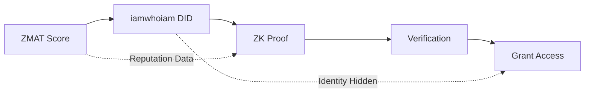

#sandbox
# iamwhoiam DID: Decentralized Identity with Privacy-Preserving Reputation
*Generated: 2025-09-04 | Source: July 2025 Portfolio Conversations*

## 🔐 Core Concept: Identity Without Exposure

### The Technical Foundation
**iamwhoiam DID Prototype** - A decentralized identity system built on:
- **did:key** protocol for self-sovereign identity
- **BBS+ signatures** for selective disclosure 
- **Zero-knowledge proofs** via SnarkJS
- **Reputation without identity leakage**

### The Privacy Innovation
```
Traditional Identity: Show ID → Reveal Everything
iamwhoiam DID: Prove Claims → Reveal Nothing
```

## 🎭 The Zero-Knowledge Magic

### How It Works
```javascript
// Traditional approach (exposes everything)
verifyIdentity(fullCredentials) → {
  name: "Mordechai",
  reputation: 850,
  history: [...everything...]
}

// iamwhoiam approach (selective disclosure)
proveReputation(zkProof) → {
  claim: "reputation > X",
  valid: true,
  identity: HIDDEN
}
```

### The BBS+ Advantage
BBS+ signatures enable:
1. **Selective Disclosure** - Show only what's needed
2. **Unlinkability** - Different proofs can't be connected
3. **Efficiency** - Compact proofs, fast verification
4. **Privacy** - Zero correlation between presentations

## 🔗 Integration with ZMAT Protocol

### The Synergy


### Cross-System Benefits
| Component | Purpose | Privacy Level |
|-----------|---------|---------------|
| ZMAT | Generates reputation score | Public scoring |
| iamwhoiam | Carries reputation | Private identity |
| ZK Circuit | Proves threshold | Zero disclosure |
| Verifier | Checks proof | Learns nothing |

## 🛠️ Technical Architecture

### Current Implementation (v0.4)
```yaml
Identity_Layer:
  - Protocol: did:key
  - Key_Type: BBS+ (BLS12-381)
  - Storage: Self-sovereign (user controls keys)
  
Signature_Layer:
  - Algorithm: BBS+ signatures
  - Features: Selective disclosure, unlinkability
  - Performance: ~10ms sign, ~5ms verify
  
Proof_Layer:
  - Framework: SnarkJS
  - Circuit: "Over X reputation" 
  - Proving_Time: ~2 seconds
  - Verification_Time: ~20ms
  
Integration:
  - ZMAT_Bridge: Import reputation scores
  - API: REST + WebSocket for real-time
  - SDK: TypeScript/JavaScript
```

### The ZK-Auth Circuit
```javascript
// Simplified circuit logic
circuit ReputationThreshold {
  // Private inputs (never revealed)
  signal private input reputation;
  signal private input identity;
  
  // Public inputs (what verifier sees)
  signal input threshold;
  signal output valid;
  
  // Prove reputation > threshold without revealing actual value
  component gt = GreaterThan();
  gt.in[0] <== reputation;
  gt.in[1] <== threshold;
  valid <== gt.out;
}
```

## 💡 Use Cases & Applications

### 1. Anonymous Credentialing
- **Job Applications**: Prove qualifications without revealing identity
- **Dating Apps**: Verify reputation without doxxing
- **Forums**: Weighted voting based on reputation, anonymous participation

### 2. Selective Access Control
- **Exclusive Communities**: Prove membership criteria without ID
- **Age Verification**: Prove >18 without revealing birthdate
- **Financial**: Prove creditworthiness without exposing history

### 3. Privacy-Preserving Commerce
- **Marketplace Trust**: Show you're trusted seller without history
- **Service Access**: Prove subscription without account details
- **Peer-to-Peer**: Reputation-gated transactions, privacy maintained

## 🌟 The Revolutionary Insight

### Traditional Systems Force a Trade-off:
```
Privacy ←→ Trust
(More privacy = Less trust)
```

### iamwhoiam Breaks the Trade-off:
```
Privacy + Trust
(Full privacy WITH full trust)
```

## 🔮 Future Enhancements

### Phase 2: Advanced Features
- [ ] Multi-party computation for distributed proofs
- [ ] Attribute-based credentials (prove multiple claims)
- [ ] Revocation without correlation
- [ ] Cross-chain identity bridges

### Phase 3: Ecosystem Integration
- [ ] WOTCFY platform integration
- [ ] Universal reputation portability
- [ ] Decentralized identifier registry
- [ ] Privacy-preserving analytics

## 🎯 The Core Value Proposition

**"Prove anything about yourself without revealing who you are."**

In a world where:
- Data breaches are constant
- Identity theft is rampant  
- Privacy is disappearing
- Trust is essential

iamwhoiam provides:
- **Absolute privacy** with **complete verifiability**
- **Portable reputation** without **identity exposure**
- **Selective disclosure** with **cryptographic proof**
- **Zero-knowledge trust** in a **trustless world**

## 🔗 Connection Points

### With ZMAT Protocol
- ZMAT generates the reputation scores
- iamwhoiam carries them privately
- Together: **Trusted interactions without identity exposure**

### With WOTCFY Platform  
- Job seekers prove qualifications anonymously
- Employers verify without bias
- Together: **Merit-based hiring without discrimination**

### With Hyperfocus Sessions
- Prove productivity metrics privately
- Verify focus achievements
- Together: **Performance validation without surveillance**

## 📊 Technical Advantages Over Alternatives

| Feature | Traditional ID | Blockchain ID | iamwhoiam DID |
|---------|---------------|---------------|---------------|
| Privacy | ❌ None | ⚠️ Pseudonymous | ✅ Full |
| Selective Disclosure | ❌ All or nothing | ⚠️ Limited | ✅ Granular |
| Unlinkability | ❌ Fully tracked | ⚠️ Chain analysis | ✅ Uncorrelatable |
| Reputation Portability | ❌ Siloed | ✅ On-chain | ✅ Cross-platform |
| Proof Without Reveal | ❌ Must show all | ❌ Visible on-chain | ✅ Zero-knowledge |

## 🚀 Implementation Status

### Completed (v0.4)
- ✅ did:key infrastructure
- ✅ BBS+ signature implementation
- ✅ Basic ZK circuits for reputation
- ✅ Proof generation/verification

### In Development
- 🔄 ZMAT score integration
- 🔄 Multi-attribute proofs
- 🔄 Mobile SDK
- 🔄 Universal resolver

### Planned
- 📋 Enterprise API
- 📋 Compliance frameworks
- 📋 Interoperability standards
- 📋 Decentralized registry

---

## The Pashut Truth

**iamwhoiam isn't just another identity system. It's the answer to the impossible question: How can you trust someone completely while knowing nothing about them?**

Through the mathematical beauty of zero-knowledge proofs and the cryptographic elegance of BBS+ signatures, iamwhoiam delivers what seemed impossible: 

**Complete privacy WITH complete trust.**

In the age of surveillance capitalism and data exploitation, iamwhoiam represents a fundamental shift - from "trust requires transparency" to "trust requires proof, not exposure."

---

*The breakthrough: You can be anyone and no one simultaneously. Fully verified yet completely anonymous. Trusted without being known.*