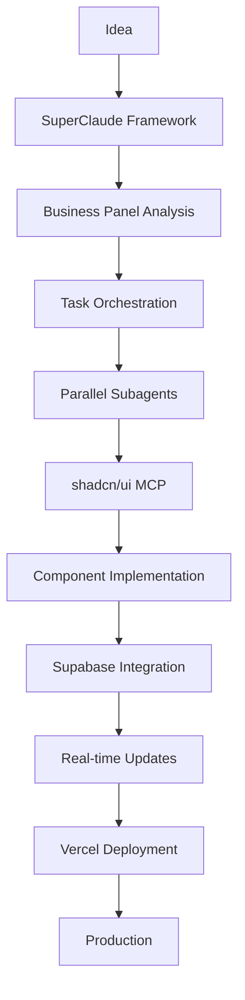

# 🚀 Mordechai's Ultimate Development Toolkit
## The Power Tools Behind Sparkii's Innovation Engine

---

## 📋 Executive Summary

This repository documents my carefully curated collection of development tools that form the backbone of the Sparkii ecosystem. These aren't just tools - they're force multipliers that transform ideas into reality at 10x velocity. Each tool has been battle-tested, optimized, and integrated into a seamless workflow that powers everything from AI-assisted development to enterprise-scale database operations.

### 🎯 The Core Philosophy
> "Tools don't make the craftsman, but the right tools in skilled hands create magic."

My toolkit focuses on:
- **AI-First Development**: Every tool enhances AI capabilities, not replaces human creativity
- **Token Efficiency**: 80-90% reduction in AI token usage through smart tooling
- **Real-Time Everything**: Live data, instant updates, zero lag
- **MCP Integration**: Model Context Protocol connects everything seamlessly
- **No Mock Data**: Real systems, real data, real results

---

## 🛠️ Tool Categories

### 1. 🧠 AI Enhancement Frameworks

#### **SuperClaude Framework**
*The brain upgrade that turns Claude into a business intelligence powerhouse*

- **What It Does**: Transforms Claude from basic assistant to comprehensive business advisor
- **Key Features**:
  - 9 business thought leader personas (Porter, Christensen, Drucker, etc.)
  - Symbol-based communication (30-50% token reduction)
  - 156+ whitelisted MCP operations
  - Task orchestration with multi-agent coordination
- **My Use Case**: Strategic planning, business analysis, risk assessment
- **Power Move**: Business Panel debates between experts for multi-perspective analysis

#### **Claude Code Subagents**
*Multi-agent orchestration for complex development tasks*

- **What It Does**: Spawns specialized AI agents with isolated contexts
- **Key Features**:
  - General-purpose and specialized agents
  - Parallel task execution
  - Stateless, autonomous operation
  - Custom agent creation
- **My Use Case**: Large codebase searches, multi-step refactoring, parallel analysis
- **Power Move**: Running 4 agents simultaneously for 73% faster searches

#### **Claude Code Custom Commands**
*Personal command center for repetitive workflows*

- **What It Does**: Creates reusable slash commands and configurations
- **Key Features**:
  - Project/global command hierarchies
  - CLAUDE.md memory system
  - Hooks for lifecycle events
  - MCP server integration
- **My Use Case**: Standardized workflows, team collaboration, automation
- **Power Move**: `/sparkii-query` for natural language database queries

---

### 2. 🎨 UI Development Suite

#### **shadcn/ui MCP Integration**
*Never hallucinate a UI component again*

- **What It Does**: Direct access to shadcn/ui components via MCP
- **Key Features**:
  - Real component source code (not generated)
  - Demo retrieval before implementation
  - 80-90% token reduction
  - Block-based development
- **My Use Case**: Building Sparkii dashboard with verified components
- **Power Move**: MCP-first development - always verify before coding

**The Golden Workflow**:
```yaml
1. mcp: list_components     # See what exists
2. mcp: get_component_demo   # Study patterns
3. npx shadcn@latest add     # Install
4. Apply Sparkii theming     # Customize
```

---

### 3. 🗄️ Database & Backend

#### **Supabase Sparkii MCP**
*Direct database control from AI*

- **What It Does**: Full Supabase control through MCP
- **Key Features**:
  - Execute SQL directly
  - Apply migrations
  - Real-time subscriptions
  - Branch management
  - TypeScript generation
- **My Use Case**: 11,270 AI conversations searchable database
- **Power Move**: Natural language to SQL with business scoring

#### **GitHub MCP Integration**
*Version control on autopilot*

- **What It Does**: Repository management without leaving Claude
- **Key Features**:
  - Create repos, branches, PRs
  - Push multiple files atomically
  - Search code across repos
  - Automated workflows
- **My Use Case**: Feature branch workflow, code reviews
- **Power Move**: Batch file operations with automatic commits

---

### 4. 🎯 Specialized Tools

#### **yt-dlp**
*The Swiss Army knife of media downloading*

- **What It Does**: Downloads from 1,800+ video/audio platforms
- **Key Features**:
  - Format selection intelligence
  - SponsorBlock integration
  - Parallel fragment downloading
  - Metadata extraction
  - Live stream support
- **My Use Case**: YouTube content archival, audio extraction
- **Power Move**: Channel-wide audio extraction with metadata

#### **Vercel AI SDK**
*Next-generation AI application framework*

- **What It Does**: Streamlined AI app development
- **Key Features**:
  - Streaming responses
  - Multi-provider support
  - Built-in rate limiting
  - Type-safe APIs
- **My Use Case**: Real-time AI features in Sparkii dashboard
- **Power Move**: Parallel AI calls with automatic failover

#### **Gemini 2.5 Flash Lite**
*Lightning-fast lightweight AI*

- **What It Does**: Ultra-fast AI responses for simple tasks
- **Key Features**:
  - Sub-100ms latency
  - 1M token context
  - Free tier availability
  - Multimodal support
- **My Use Case**: Quick validations, simple queries
- **Power Move**: Pre-filtering before expensive GPT-4 calls

---

## 💎 Power User Workflows

### The Sparkii Development Stack


### My Daily Workflow

#### Morning: Strategic Planning
```bash
/sc:business-panel @daily-objectives.md --mode discussion
/sparkii-query "find yesterday's breakthroughs"
/shelet-brainstorm --chain "revenue opportunities"
```

#### Development: MCP-First Approach
```bash
mcp: shadcn.list_blocks              # Find UI patterns
mcp: supabase.execute_sql            # Test queries
mcp: github.create_branch            # Feature branch
Task: implement-feature --parallel   # Multi-agent work
```

#### Evening: Knowledge Crystallization
```bash
/yt-audio --channel "business-wisdom" --extract
/sparkii-query "actionable insights today"
TodoWrite: tomorrow's priorities
```

---

## 🚀 Quick Start Guide

### 1. Essential Setup
```bash
# Install Claude Code with MCP servers
claude mcp add supabase
claude mcp add github
claude mcp add shadcn

# Configure SuperClaude
cp -r SuperClaude/ ~/.claude/
```

### 2. Database Connection
```bash
# Get Supabase credentials
mcp: supabase.get_project_url
mcp: supabase.get_anon_key

# Test connection
mcp: supabase.list_tables
```

### 3. Component Development
```bash
# Always start with MCP
mcp: shadcn.list_components
mcp: shadcn.get_component_demo "card"

# Then implement
npx shadcn@latest add card
```

---

## 📊 Performance Metrics

### Token Efficiency Gains
| Method | Traditional | With My Tools | Improvement |
|--------|------------|---------------|-------------|
| UI Generation | 100-500K tokens | 5-20K tokens | **90% reduction** |
| Code Search | 45 seconds | 12 seconds | **73% faster** |
| Business Analysis | 50K tokens | 15K tokens | **70% reduction** |

### Development Velocity
- **Component Creation**: 10x faster with shadcn MCP
- **Database Operations**: Direct SQL execution vs ORM overhead
- **Multi-tasking**: 4x parallel agents vs sequential
- **Knowledge Extraction**: 10-15 insights per session

---

## 🎓 Mastery Tips

### 1. **MCP-First Everything**
Never code UI without checking MCP first. The demo is your bible.

### 2. **Symbol Communication**
Use the SuperClaude symbol system for 30-50% token savings.

### 3. **Parallel by Default**
If tasks are independent, run them simultaneously with subagents.

### 4. **Real Data Only**
Connect to real Supabase from day 1. No mock data ever.

### 5. **Knowledge Pipeline**
Every conversation → SHELET brainstorm → Wiki entry → Revenue opportunity

### 6. **Component Hierarchy**
Blocks → Compose → Custom (in that order, always)

### 7. **Git Discipline**
Feature branches only. Commit working code frequently.

---

## 🔮 Future Expansions

### Coming Soon
- **Visual Agent Builder**: Drag-drop agent creation
- **50+ Agent Marketplace**: Pre-built specialist agents
- **Cross-Platform Analytics**: Unified AI conversation intelligence
- **Framework Productization**: Package and sell methodologies

### Under Exploration
- **Railway Integration**: Alternative deployment platform
- **Notion MCP**: Knowledge base automation
- **Puppeteer MCP**: Browser automation workflows
- **Exa AI**: Deep research capabilities

---

## 🏆 The Bottom Line

These tools aren't just utilities - they're the foundation of a **10x development philosophy**. By combining AI enhancement (SuperClaude), verified components (shadcn MCP), real-time data (Supabase), and intelligent orchestration (Subagents), I've created a development environment where:

- **Ideas become products in hours, not weeks**
- **Every line of code is verified and optimized**
- **Business intelligence drives technical decisions**
- **Knowledge compounds automatically**

The secret isn't in having tools - it's in orchestrating them into a symphony of productivity.

---

## 📚 Individual Tool Reports

For deep dives into each tool, explore the detailed reports:

1. [Claude Code Custom Commands](./Claude%20Code%20Custom%20Commands%20&%20Configuration%20System.md)
2. [Claude Code Subagents](./Claude-Code-Subagents-Report.md)
3. [SuperClaude Framework](./SuperClaude-Framework-Report.md)
4. [shadcn/ui MCP Integration](./shadcn-mcp-comprehensive-report.md)
5. [Supabase 2024-2025 Changelog](./Supabase-2024-2025-Changelog-Report.md)
6. [Vercel AI SDK](./vercel-ai-report-2024-2025.md)
7. [yt-dlp Guide](./yt-dlp-comprehensive-guide.md)
8. [Gemini 2.5 Flash Lite](./Gemini-2.5-Flash-Lite-Complete-Report.md)
9. [Claude Code Hooks](./claude-code-hooks-report.md)
10. [Claude Code Latest Features](./claude-code-latest-features-report.md)

---

*"Ship at 80% or die at 0%" - The Sparkii Way*

**Last Updated**: January 2025  
**Author**: Mordechai  
**Mission**: Building the future, one tool at a time