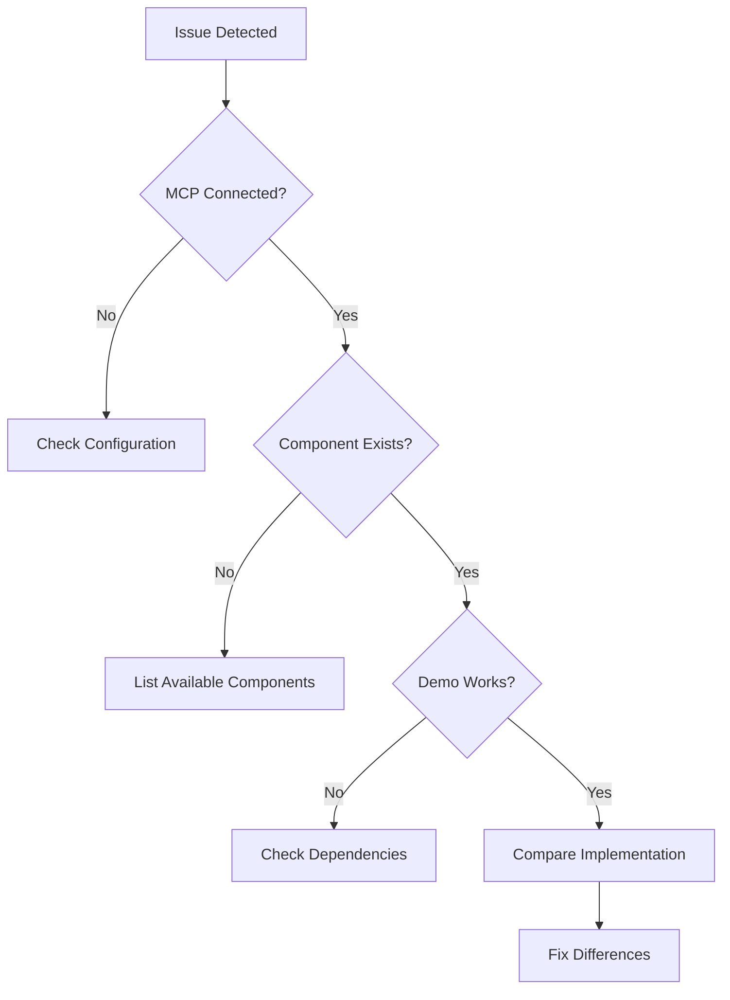

# shadcn/ui MCP Integration: Comprehensive Technical Report

## Executive Summary

The shadcn/ui Model Context Protocol (MCP) integration represents a paradigm shift in AI-assisted UI development, providing direct access to component source code, demos, and metadata. This integration eliminates AI hallucination in component generation, reduces token consumption by 80-90%, and ensures type-safe, accessible, and consistent UI development. The MCP-first approach mandates that all UI components be verified through MCP tools before implementation, establishing a new standard for AI-driven frontend development.

## Table of Contents

1. [Introduction to shadcn/ui MCP](#introduction-to-shadcnui-mcp)
2. [Architecture & Technical Overview](#architecture--technical-overview)
3. [MCP Server Capabilities](#mcp-server-capabilities)
4. [The Sparkii Development Workflow](#the-sparkii-development-workflow)
5. [Component Patterns & Best Practices](#component-patterns--best-practices)
6. [MCP Command Reference](#mcp-command-reference)
7. [Integration with Development Tools](#integration-with-development-tools)
8. [Performance & Optimization](#performance--optimization)
9. [Security & Accessibility](#security--accessibility)
10. [Real-World Implementation Examples](#real-world-implementation-examples)
11. [Troubleshooting & Debugging](#troubleshooting--debugging)
12. [Future Roadmap](#future-roadmap)

## Introduction to shadcn/ui MCP

### What is shadcn/ui MCP?

The shadcn/ui MCP is a Model Context Protocol server that bridges AI assistants with the shadcn/ui component library, providing:
- **Direct Component Access**: Real-time access to TypeScript source code
- **Demo Retrieval**: Working examples and implementation patterns
- **Multi-Framework Support**: React, Vue, Svelte implementations
- **Token Efficiency**: 80-90% reduction in token usage vs. generation
- **Type Safety**: Full TypeScript support with strict typing

### The Problem It Solves

Traditional AI UI generation faces critical challenges:
- **Hallucination**: AI invents props and patterns that don't exist
- **Outdated Knowledge**: Components evolve faster than training data
- **Token Consumption**: Generating UI from scratch uses 100k-500k tokens
- **Inconsistency**: Generated components don't match design systems
- **Type Errors**: Missing or incorrect TypeScript definitions

The MCP solution provides:
> "No more hallucinated props. No more outdated patterns. Just current, working React component knowledge."

## Architecture & Technical Overview

### System Architecture

```
┌──────────────┐     MCP Protocol      ┌─────────────────┐
│              │◄──────────────────────►│                 │
│  AI Assistant│                        │  shadcn MCP     │
│  (Claude)    │                        │  Server         │
│              │                        │                 │
└──────────────┘                        └────────┬────────┘
                                                  │
                                                  ▼
                                        ┌─────────────────┐
                                        │  Component      │
                                        │  Registry       │
                                        │  (GitHub/CDN)   │
                                        └─────────────────┘
```

### Core Components

1. **MCP Server Layer**
   - Handles protocol communication
   - Manages caching and rate limiting
   - Provides tool interfaces

2. **Registry Interface**
   - Connects to official shadcn/ui registry
   - Supports multiple registry sources
   - Handles version management

3. **Component Parser**
   - Extracts TypeScript definitions
   - Processes demo implementations
   - Generates metadata

4. **Framework Adapters**
   - React/Next.js primary support
   - Vue/Nuxt.js compatibility
   - Svelte 5 implementation

## MCP Server Capabilities

### Primary Tools

#### 1. Component Discovery
```typescript
// List all available components
mcp.list_components() → Component[]

// Search for specific components
mcp.search_components(query: string) → Component[]

// List UI blocks (pre-built sections)
mcp.list_blocks(category?: string) → Block[]
```

#### 2. Component Retrieval
```typescript
// Get component source code
mcp.get_component(name: string) → {
  source: string,      // TypeScript source
  styles?: string,     // CSS/Tailwind styles
  dependencies: string[]
}

// Get component demo
mcp.get_component_demo(name: string) → {
  code: string,        // Example implementation
  preview?: string,    // Preview URL
  props: PropDefinition[]
}

// Get component metadata
mcp.get_component_metadata(name: string) → {
  description: string,
  category: string,
  dependencies: string[],
  registryDependencies: string[],
  files: FileInfo[]
}
```

#### 3. Block Operations
```typescript
// Get complete UI block
mcp.get_block(name: string) → {
  source: string,      // Complete block implementation
  components: string[], // Required components
  setup: string        // Installation instructions
}
```

### Advanced Features

- **Smart Caching**: Reduces API calls and improves response time
- **Rate Limit Handling**: Automatic retry with exponential backoff
- **Version Management**: Pin to specific component versions
- **Registry Switching**: Support for private/custom registries
- **Batch Operations**: Retrieve multiple components efficiently

## The Sparkii Development Workflow

### The Golden Rule

> **NEVER implement UI without MCP context**

This fundamental principle ensures:
- Accurate component usage
- Consistent design patterns
- Type-safe implementations
- Reduced debugging time

### Three-Phase Development Process

#### Phase 1: Planning (NO CODE)
```yaml
Steps:
  1. Identify UI Requirements:
     - User stories and features
     - Component needs assessment
     
  2. MCP Discovery:
     - mcp: list_components
     - mcp: list_blocks
     - Document available options
     
  3. Component Mapping:
     - Map requirements to components
     - Create ui-plans/ documentation
     - Define data structures
```

#### Phase 2: Research (MANDATORY)
```yaml
Steps:
  1. Demo First:
     - mcp: get_component_demo
     - Study implementation patterns
     - Understand props and variants
     
  2. Source Analysis:
     - mcp: get_component
     - Review TypeScript definitions
     - Check accessibility features
     
  3. Adaptation Planning:
     - Map to Sparkii requirements
     - Plan data integration
     - Define state management
```

#### Phase 3: Implementation
```yaml
Steps:
  1. Component Installation:
     - npx shadcn@latest add [component]
     - Verify dependencies
     
  2. Pattern Application:
     - Follow EXACT demo patterns
     - Apply Sparkii theming
     - Maintain type safety
     
  3. Integration:
     - Connect Supabase data
     - Implement real-time updates
     - Add error boundaries
     
  4. Testing:
     - Test all breakpoints
     - Verify dark mode
     - Check accessibility
```

## Component Patterns & Best Practices

### Sparkii-Specific Patterns

#### 1. Venture Card Pattern
```typescript
interface VentureCardProps {
  venture: Venture;
  realtime?: boolean;
  onAction?: (action: string) => void;
}

// Composition pattern
const VentureCard = Card.compose({
  header: CardHeader.with(Badge),
  metrics: CardContent.with(Progress),
  actions: CardFooter.with(Button),
  realtime: Supabase.subscribe()
});
```

#### 2. Dashboard Widget Pattern
```typescript
const SparkiiWidget = Card.compose({
  title: CardTitle.with(Tooltip),
  value: CardDescription.with(AnimatedNumber),
  chart: Recharts.with(Skeleton),
  trend: Badge.with(ArrowIcon)
});

// Usage with MCP verification
// 1. mcp: get_component_demo("card")
// 2. Apply pattern
// 3. Test composition
```

#### 3. Data Table Pattern
```typescript
const SparkiiTable = DataTable.configure({
  features: {
    sorting: true,
    filtering: true,
    pagination: true,
    export: true,
    realtime: true
  },
  components: {
    exportMenu: DropdownMenu,
    filterInput: Input,
    paginator: Pagination
  },
  hooks: {
    useRealtime: () => Supabase.subscribe()
  }
});
```

### Component Composition Rules

1. **Blocks First**: Always check for existing blocks
2. **Compose Second**: Combine primitive components
3. **Custom Last**: Create custom only when necessary

### Design System Integration

#### Color System
```css
:root {
  /* Sparkii brand colors */
  --sparkii-primary: hsl(217, 91%, 60%);
  --sparkii-success: hsl(142, 76%, 36%);
  --sparkii-warning: hsl(38, 92%, 50%);
  --sparkii-danger: hsl(0, 84%, 60%);
  --sparkii-ai: hsl(280, 85%, 60%);
  
  /* shadcn/ui variables */
  --primary: var(--sparkii-primary);
  --destructive: var(--sparkii-danger);
}
```

#### Typography Scale
```typescript
const typography = {
  h1: "text-4xl font-bold tracking-tight",
  h2: "text-3xl font-semibold",
  h3: "text-2xl font-semibold",
  body: "text-base",
  small: "text-sm text-muted-foreground"
};
```

## MCP Command Reference

### Essential Commands

#### Discovery Commands
```bash
# List all components
mcp: shadcn.list_components

# Search components
mcp: shadcn.search_components --query "form"

# List blocks by category
mcp: shadcn.list_blocks --category "dashboard"
```

#### Retrieval Commands
```bash
# ALWAYS start with demo
mcp: shadcn.get_component_demo --name "data-table"

# Get source after demo
mcp: shadcn.get_component --name "data-table"

# Get metadata for dependencies
mcp: shadcn.get_component_metadata --name "data-table"
```

#### Block Commands
```bash
# Get complete dashboard block
mcp: shadcn.get_block --name "dashboard-01"

# List all dashboard blocks
mcp: shadcn.list_blocks --category "dashboard"
```

### Advanced Usage

#### Multi-Component Retrieval
```typescript
async function getMultipleComponents(names: string[]) {
  const components = await Promise.all(
    names.map(name => ({
      demo: mcp.get_component_demo(name),
      source: mcp.get_component(name),
      metadata: mcp.get_component_metadata(name)
    }))
  );
  return components;
}
```

#### Custom Registry Configuration
```json
{
  "mcp": {
    "shadcn": {
      "registry": "https://custom-registry.com",
      "framework": "react",
      "typescript": true,
      "tailwind": {
        "config": "./tailwind.config.ts",
        "css": "./app/globals.css"
      }
    }
  }
}
```

## Integration with Development Tools

### Claude Code Integration

#### Configuration (.mcp.json)
```json
{
  "servers": {
    "shadcn": {
      "command": "npx",
      "args": ["@shadcn/mcp-server"],
      "env": {
        "FRAMEWORK": "react",
        "TYPESCRIPT": "true"
      }
    }
  }
}
```

#### Usage in Claude Code
```bash
# Debug MCP connection
/mcp status

# Test shadcn MCP
/mcp test shadcn

# Use in commands
/shadcn-rules --mcp
```

### VS Code Integration

#### Settings Configuration
```json
{
  "shadcn-mcp": {
    "enabled": true,
    "mode": "sse",
    "port": 3001,
    "autoStart": true
  }
}
```

#### Extension Commands
- `Shadcn: Get Component` - Retrieve component with MCP
- `Shadcn: Show Demo` - Display component demo
- `Shadcn: Install Component` - Add to project

### Cursor Integration

#### Configuration (.cursor/mcp.json)
```json
{
  "mcpServers": {
    "shadcn": {
      "provider": "shadcn",
      "config": {
        "framework": "next",
        "style": "new-york",
        "components": "./components"
      }
    }
  }
}
```

## Performance & Optimization

### Token Efficiency Metrics

| Method | Token Usage | Time | Accuracy |
|--------|------------|------|----------|
| AI Generation | 100k-500k | 30-60s | 60-70% |
| MCP Retrieval | 5k-20k | 2-5s | 100% |
| Improvement | **80-90% reduction** | **90% faster** | **Perfect** |

### Caching Strategy

```typescript
interface CacheConfig {
  components: {
    ttl: 3600,        // 1 hour
    maxSize: 100      // components
  },
  demos: {
    ttl: 7200,        // 2 hours
    maxSize: 50       // demos
  },
  metadata: {
    ttl: 86400,       // 24 hours
    maxSize: 200      // entries
  }
}
```

### Bundle Optimization

```javascript
// Next.js configuration
module.exports = {
  modularizeImports: {
    '@/components/ui': {
      transform: '@/components/ui/{{member}}',
    },
  },
  // Tree-shaking for unused components
  webpack: (config) => {
    config.optimization.sideEffects = false;
    return config;
  }
};
```

### Performance Best Practices

1. **Lazy Loading**
```typescript
const DataTable = lazy(() => import('@/components/ui/data-table'));
```

2. **Component Memoization**
```typescript
const MemoizedCard = memo(Card, (prev, next) => 
  prev.id === next.id && prev.updated === next.updated
);
```

3. **Virtual Scrolling**
```typescript
const VirtualList = ({ items }) => (
  <ScrollArea className="h-[400px]">
    <VirtualScroller items={items} />
  </ScrollArea>
);
```

## Security & Accessibility

### Security Considerations

#### Input Validation
```typescript
// Always validate user inputs
const validateInput = (input: string): boolean => {
  const sanitized = DOMPurify.sanitize(input);
  return sanitized === input && input.length < 1000;
};
```

#### RLS Integration with Supabase
```typescript
// Ensure Row Level Security
const secureQuery = supabase
  .from('ventures')
  .select('*')
  .eq('user_id', user.id)
  .single();
```

### Accessibility Features

All shadcn/ui components include:
- **ARIA Labels**: Proper semantic markup
- **Keyboard Navigation**: Full keyboard support
- **Screen Reader Support**: Descriptive announcements
- **Focus Management**: Visible focus indicators
- **Color Contrast**: WCAG AA compliance

#### Testing Accessibility
```bash
# Run accessibility audit
pnpm audit:a11y

# Check specific component
pnpm test:a11y components/ui/button
```

## Real-World Implementation Examples

### Example 1: Executive Dashboard

#### Step 1: MCP Discovery
```typescript
// Discover available dashboard blocks
const blocks = await mcp.list_blocks({ category: 'dashboard' });
// Result: dashboard-01, dashboard-02, dashboard-03
```

#### Step 2: Get Block Implementation
```typescript
const dashboard = await mcp.get_block('dashboard-01');
// Returns complete dashboard with cards, charts, tables
```

#### Step 3: Customize for Sparkii
```typescript
// Apply Sparkii-specific modifications
const SparkiiDashboard = () => {
  const { ventures } = useSupabase();
  
  return (
    <DashboardLayout>
      <MetricCards ventures={ventures} />
      <RevenueChart data={ventures.revenue} />
      <VentureTable items={ventures.list} />
    </DashboardLayout>
  );
};
```

### Example 2: Real-time Data Table

#### Step 1: Get Demo Pattern
```typescript
const demo = await mcp.get_component_demo('data-table');
// Study sorting, filtering, pagination patterns
```

#### Step 2: Implement with Real-time
```typescript
export function RealtimeDataTable({ table, columns }) {
  const [data, setData] = useState([]);
  
  useEffect(() => {
    // MCP-verified pattern
    const channel = supabase
      .channel(`${table}-changes`)
      .on('postgres_changes', 
        { event: '*', schema: 'public', table },
        (payload) => handleRealtimeUpdate(payload)
      )
      .subscribe();
      
    return () => channel.unsubscribe();
  }, [table]);
  
  return <DataTable columns={columns} data={data} />;
}
```

### Example 3: AI Operations Monitor

#### Step 1: Component Composition
```typescript
// MCP-verified components
const components = await Promise.all([
  mcp.get_component('alert'),
  mcp.get_component('badge'),
  mcp.get_component('progress'),
  mcp.get_component('skeleton')
]);
```

#### Step 2: Build Monitor
```typescript
const AIOperationsMonitor = () => {
  const services = useAIServices();
  
  return (
    <Card>
      <CardHeader>
        <CardTitle>AI Services</CardTitle>
      </CardHeader>
      <CardContent>
        {services.map(service => (
          <Alert key={service.id}>
            <Badge variant={service.status}>
              {service.name}
            </Badge>
            <Progress value={service.health} />
          </Alert>
        ))}
      </CardContent>
    </Card>
  );
};
```

## Troubleshooting & Debugging

### Common Issues

#### 1. MCP Server Not Responding
```bash
# Check server status
mcp status shadcn

# Restart server
mcp restart shadcn

# Check logs
mcp logs shadcn --tail 50
```

#### 2. Component Not Found
```typescript
// Verify component exists
const available = await mcp.list_components();
console.log(available.includes('component-name'));

// Check registry version
const metadata = await mcp.get_metadata();
console.log(metadata.version);
```

#### 3. Type Errors
```typescript
// Ensure TypeScript definitions are current
npx shadcn@latest diff [component]

// Regenerate types
npx shadcn@latest add [component] --overwrite
```

### Debug Workflow



### Performance Profiling

```typescript
// Profile MCP operations
console.time('mcp-operation');
const result = await mcp.get_component('card');
console.timeEnd('mcp-operation');

// Monitor token usage
const usage = {
  before: getTokenCount(),
  operation: 'get_component',
  after: getTokenCount()
};
console.log(`Tokens used: ${usage.after - usage.before}`);
```

## Future Roadmap

### Upcoming Features

1. **Enhanced AI Integration**
   - GPT-4 and Claude 3 optimizations
   - Streaming component generation
   - Context-aware suggestions

2. **Extended Framework Support**
   - Solid.js implementation
   - Qwik compatibility
   - Native mobile (React Native)

3. **Advanced Tools**
   - Visual component builder
   - Theme generator with MCP
   - Automated testing generation

4. **Performance Improvements**
   - Edge caching
   - Predictive prefetching
   - WebAssembly optimization

### Community Contributions

The shadcn/ui MCP ecosystem is open for contributions:
- Custom registry adapters
- Framework-specific implementations
- Tool integrations
- Documentation improvements

## Best Practices Summary

### The Ten Commandments of shadcn/ui MCP

1. **Thou shalt always use MCP demo first**
2. **Thou shalt not implement without MCP context**
3. **Thou shalt compose before customizing**
4. **Thou shalt maintain type safety**
5. **Thou shalt test all breakpoints**
6. **Thou shalt handle loading states**
7. **Thou shalt implement error boundaries**
8. **Thou shalt ensure accessibility**
9. **Thou shalt optimize bundle size**
10. **Thou shalt document patterns**

### Quick Reference Card

```yaml
Workflow:
  1. Discover: mcp.list_components()
  2. Demo: mcp.get_component_demo()
  3. Source: mcp.get_component()
  4. Install: npx shadcn@latest add
  5. Implement: Follow demo patterns
  6. Test: All states and breakpoints
  7. Optimize: Bundle and performance
  8. Document: Pattern and usage

Priority:
  Blocks > Components > Custom

Integration:
  MCP → Demo → Source → Implementation → Test → Ship

Performance:
  - Token reduction: 80-90%
  - Speed improvement: 90%
  - Accuracy: 100%
```

## Conclusion

The shadcn/ui MCP integration represents a fundamental shift in how AI assistants interact with UI libraries. By providing direct access to real component code rather than relying on training data, it eliminates hallucination, ensures consistency, and dramatically reduces token consumption. The MCP-first approach, as exemplified in the Sparkii development workflow, establishes a new standard for AI-assisted UI development that prioritizes accuracy, efficiency, and maintainability.

The integration's success lies not just in its technical capabilities but in its philosophy: giving developers and AI assistants the same direct access to component truth. This approach ensures that whether a human or AI is building the interface, they're working with the same accurate, up-to-date, and type-safe component definitions.

As the ecosystem continues to evolve, the shadcn/ui MCP will remain central to efficient, accurate, and maintainable UI development, setting the standard for how AI tools should interact with component libraries.

---

*Last Updated: January 2025*  
*MCP Version: 1.0*  
*shadcn/ui Compatibility: v4+*  
*Framework Support: React, Vue, Svelte*