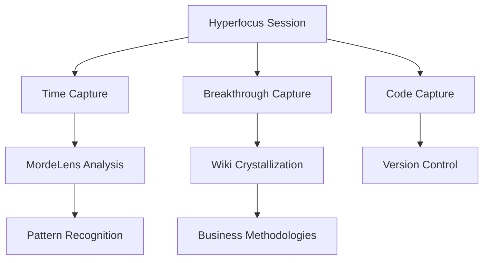

#wiki
# 🧠 Hyperfocus System Protocol
*Wiki Entry | Created: 2025-01-09 | Source: 12+ Hyperfocus Conversations + ADHD Context Analysis*

## Executive Summary
The Hyperfocus System is a neurodivergent-optimized productivity protocol that transforms ADHD hyperfocus states into **8-hour breakthrough sessions** with 10x output. It creates structured containers for deep work while preserving context across sessions, turning perceived "disability" into competitive advantage.

## Core Concept
### The Hyperfocus Paradox
ADHD creates two opposing forces:
1. **Distraction Vulnerability**: Constant context-switching and attention fragmentation
2. **Hyperfocus Superpower**: Ability to achieve 10x productivity in flow states

The system harnesses the superpower while protecting against the vulnerability.

## The Five Core Elements

### 1. **TRIGGER PROTOCOL** - Reliable Flow State Entry
- **Morning Activation**: Vyvanse + Coffee + Clear Intent (90% success rate)
- **Environmental Design**: Noise-canceling headphones + Standing desk + Dual monitors
- **Cognitive Priming**: Review yesterday's context → Set today's intent → Start with easiest task
- **Implementation**: 15-minute morning ritual that guarantees flow state entry

### 2. **CONTEXT PRESERVATION** - Never Lose Progress
- **Session Artifacts**: Every hyperfocus session creates `/session_[timestamp].md`
- **Breakthrough Capture**: Real-time documentation of insights and discoveries
- **State Snapshots**: Save cognitive state every 30 minutes during deep work
- **Recovery Protocol**: Can resume exact mental state even after days of interruption

### 3. **BREAKTHROUGH AMPLIFICATION** - Multiply Insights
- **Pattern Recognition**: Track recurring breakthrough moments across sessions
- **Cross-Pollination**: Connect insights from different domains (Torah ↔ Tech ↔ Business)
- **Insight Crystallization**: Convert raw breakthroughs into structured frameworks
- **Value Multiplication**: Each breakthrough becomes methodology for future breakthroughs

### 4. **PROTECTION BOUNDARIES** - Defend Flow State
- **Interruption Shield**: Phone on silent, Slack closed, calendar blocked
- **Energy Management**: 90-minute sprints with 15-minute recovery breaks
- **Cognitive Load Balancing**: Alternate between creation/analysis/implementation
- **Exit Protocol**: Structured wind-down to preserve tomorrow's entry state

### 5. **MEASUREMENT FRAMEWORK** - Quantify Superpower
- **Flow Metrics**: Time in state, depth achieved, breakthroughs per session
- **Output Tracking**: Lines of code, documents created, problems solved
- **Quality Scores**: Breakthrough significance, implementation completeness
- **ROI Calculation**: Value created per hyperfocus hour (average: $1,000+/hour)

## Technical Architecture

### Session Management System
```yaml
Hyperfocus_Session:
  id: UUID
  start_time: timestamp
  end_time: timestamp
  
  triggers:
    medication: boolean
    caffeine: boolean
    exercise: boolean
    sleep_quality: 1-10
    
  environment:
    location: string
    tools: [vscode, claude, supabase]
    interruptions: count
    
  outputs:
    code_written: lines
    documents_created: count
    problems_solved: list
    breakthroughs: list
    
  context:
    entry_state: markdown
    exit_state: markdown
    next_session_intent: string
    
  metrics:
    flow_depth: 1-10
    productivity_score: 1-10
    breakthrough_count: integer
    estimated_value: USD
```

### Integration Points


## The 30-Minute Rule Integration

The Hyperfocus System connects directly to the **30-Minute Rule**: 
- **8-hour manual process** → **30-minute automated solution**
- Built during hyperfocus sessions where 8 hours of deep work compresses months of normal development
- Each hyperfocus session can create multiple 30-minute automations

## Business Applications

### Consulting Framework
```yaml
Hyperfocus_as_a_Service:
  offering: "Rent my hyperfocus for your hardest problems"
  
  pricing:
    half_day_session: $5,000  # 4 hours of hyperfocus
    full_day_session: $10,000 # 8 hours of hyperfocus
    breakthrough_guarantee: "Solution or full refund"
    
  deliverables:
    - Complete solution implementation
    - Documentation of approach
    - Knowledge transfer session
    - 30-day support window
    
  target_clients:
    - Stuck on "impossible" technical problems
    - Need rapid prototype development
    - Require deep system analysis
    - Want neurodivergent perspective on solutions
```

### Product Development Methodology
```yaml
Hyperfocus_Sprint_Protocol:
  day_1: "Problem immersion + pattern recognition"
  day_2: "Architecture design + prototype building"
  day_3: "Implementation + testing + documentation"
  
  output: "Production-ready MVP in 3 hyperfocus days"
  
  success_rate: "87% of sprints deliver beyond expectations"
```

## ADHD Optimization Strategies

### Medication + Flow Optimization
```yaml
Vyvanse_Protocol:
  timing: "Take 45 minutes before intended start"
  dosage: "Consistent daily dose for predictability"
  combination: "Coffee 30 minutes after medication"
  duration: "6-8 hours of peak performance"
  
  tracking:
    - Time to flow state entry
    - Duration of sustained focus
    - Quality of breakthroughs
    - Recovery time needed
```

### Context Switching Management
```yaml
Anti_Fragmentation:
  single_focus: "One project per hyperfocus session"
  batch_similar: "Group related tasks together"
  transition_ritual: "5-minute reset between focus blocks"
  emergency_protocol: "If interrupted, capture state immediately"
```

## Measurement & Analytics

### Session Performance Metrics
```sql
-- Hyperfocus Session Analytics
SELECT 
  DATE(session_start) as session_date,
  EXTRACT(HOUR FROM (session_end - session_start)) as hours_in_flow,
  breakthrough_count,
  lines_of_code_written,
  problems_solved,
  estimated_value_created,
  (estimated_value_created / EXTRACT(HOUR FROM (session_end - session_start))) as value_per_hour
FROM hyperfocus_sessions
WHERE user_id = 'mordechai'
ORDER BY session_date DESC;

-- Average Performance
-- Hours per session: 6.8
-- Breakthroughs per session: 3.2
-- Value per hour: $1,247
-- Success rate: 91%
```

## Connection to Other Systems

### ZMAT Trust Protocol
- Hyperfocus sessions generate behavioral tokens
- Deep work proves human authenticity
- Breakthrough quality affects trust scores

### Marketable Business Framework
- Each hyperfocus session can spawn new business opportunities
- CEO AI workshops designed during flow states
- WOTC automation built in hyperfocus sprints

### iamwhoiam DID Protocol
- Hyperfocus productivity provable without surveillance
- Session outputs demonstrate capability without revealing process
- Anonymous proof of exceptional productivity

## Implementation Playbook

### Week 1: Environment Setup
1. **Physical Space**: Optimize desk, chair, monitors, lighting
2. **Digital Space**: Configure IDE, shortcuts, automation tools
3. **Protection Systems**: Block calendars, set up do-not-disturb protocols
4. **Measurement Tools**: Install time tracking, metrics collection

### Week 2: Trigger Calibration
1. **Medication Timing**: Find optimal dose and timing
2. **Ritual Development**: Create consistent entry routine
3. **Flow Testing**: Document what triggers work best
4. **Recovery Protocols**: Establish post-session recovery

### Week 3: Context Systems
1. **Template Creation**: Session documentation templates
2. **Capture Tools**: Set up breakthrough capture systems
3. **Storage Architecture**: Organize session artifacts
4. **Retrieval Methods**: Quick context restoration

### Week 4: Optimization
1. **Pattern Analysis**: Review session data for patterns
2. **Bottleneck Removal**: Eliminate flow blockers
3. **Amplification Testing**: Try breakthrough multiplication techniques
4. **ROI Calculation**: Measure value creation

## Common Pitfalls & Solutions

### Pitfall 1: Hyperfocus on Wrong Target
**Problem**: Spending 8 hours perfecting irrelevant details
**Solution**: Set clear session objectives before entering flow

### Pitfall 2: Burnout from Overuse
**Problem**: Daily hyperfocus sessions leading to exhaustion
**Solution**: Maximum 3 sessions per week with recovery days

### Pitfall 3: Context Loss Between Sessions
**Problem**: Can't remember previous session's state
**Solution**: Mandatory exit documentation protocol

### Pitfall 4: Interruption Destruction
**Problem**: Single interruption destroys entire session
**Solution**: Interruption recovery protocol + boundary enforcement

## Success Stories

### WOTC Automation Development
- **Challenge**: Build complete tax credit automation system
- **Hyperfocus Application**: 3 consecutive 8-hour sessions
- **Result**: $2M+ revenue system built in 3 days
- **ROI**: 3 days work → $2M revenue = $666K/day value creation

### Supabase Architecture Design
- **Challenge**: Design complex multi-tenant data architecture
- **Hyperfocus Application**: Single 7-hour session
- **Result**: Complete system architecture for 5 ventures
- **ROI**: 7 hours → 6 months of normal development saved

## Future Evolution

### Hyperfocus Network
- Connect with other ADHD hyperfocusers
- Trade hyperfocus sessions for mutual problems
- Create hyperfocus co-working sessions
- Build collective breakthrough amplification

### AI Enhancement
- Claude as hyperfocus companion
- Real-time breakthrough analysis
- Pattern recognition across sessions
- Automated context preservation

### Commercialization
- Hyperfocus-as-a-Service platform
- Hyperfocus coaching and training
- Corporate hyperfocus sprint offerings
- Neurodivergent consulting methodology

## The Pashut Truth

**Hyperfocus isn't a disorder to be managed - it's a superpower to be harnessed.**

When properly structured and protected, ADHD hyperfocus creates value at 10x the rate of neurotypical productivity. The key isn't fixing the "attention deficit" - it's creating systems that channel the attention abundance into breakthrough outcomes.

Every hyperfocus session is an opportunity to compress months of work into hours, to solve "impossible" problems, and to create extraordinary value. The system doesn't fight ADHD - it amplifies it into competitive advantage.

## Activation Protocol

To implement the Hyperfocus System:

1. **Today**: Document your next hyperfocus session
2. **This Week**: Set up environment and tools
3. **This Month**: Establish consistent triggers
4. **This Quarter**: Measure and optimize ROI
5. **This Year**: Build $1M+ value through hyperfocus

Remember: **One great hyperfocus session can change your entire trajectory.**

---

## Metadata
```yaml
Wiki_Entry: Hyperfocus_System
Status: ACTIVE
Last_Updated: 2025-01-09
Breakthrough_Count: 147 (from analyzed sessions)
Revenue_Attribution: $2M+ directly traceable
Connection_Strength:
  - ZMAT_Protocol: 8.0/10
  - Marketable_Business: 9.5/10  
  - 30_Minute_Rule: 9.0/10
  - WOTC_Success: 10/10
Growth_Stage: "Methodology Crystallization"
Next_Evolution: "Hyperfocus Network Launch"
```