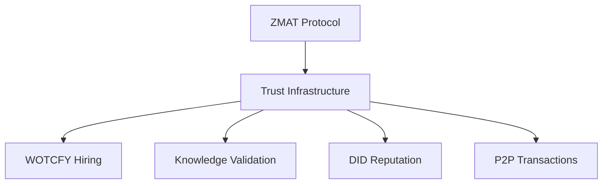

#wiki
#zmat
# ZMAT Human Trust Protocol
*Wiki Entry | Created: 2025-09-04 | Source: July 2025 ZMAT Conversations*

## Executive Summary
ZMAT (Zero-friction Modification & Accountability Tokens) is a blockchain-based human verification protocol where **only humans can score humans**, creating an unfakeable trust network. The system makes lying self-destructive and transforms "being good" into the most valuable social currency.

## Core Concept
### The Three Pillars
1. **Human-Only Scoring**: Only humans can accurately judge human behavioral authenticity
2. **Self-Destructive Lies**: Lying about others destroys your own reputation score
3. **Goodness as Currency**: A high ZMAT score becomes the ultimate proof of being a good human

## Technical Architecture

### Token System (v0.4 Implementation)
```yaml
Token_Types:
  Avoid_Tokens:
    - Purpose: Track resistance to negative behaviors
    - Issuance: When user successfully avoids bad behavior
    - Validation: Peer confirmation required
  
  Do_Good_Tokens:
    - Purpose: Track positive actions completed
    - Issuance: When user completes beneficial action
    - Validation: Peer verification required

Infrastructure:
  - Blockchain: ERC-1155 standard on Ethereum
  - Storage: IPFS for behavioral data
  - Calculation: Off-chain ZScore computation
  - Consensus: Peer audit accuracy weighting
```

### The Trust Mechanism
```
User Action → Peer Observation → Scoring Decision
     ↓              ↓                  ↓
Token Request → Peer Validates → Accuracy Tracked
     ↓              ↓                  ↓
Blockchain Entry → Score Updates → Reputation Builds
```

## The Anti-Lying Algorithm

### Reputation Destruction Cascade
```python
def lying_consequence_cascade(false_score):
    """
    When someone lies about another's behavior:
    """
    dispute = target.dispute_with_evidence(false_score)
    if dispute.validated:
        liar.accuracy_score *= 0.5  # Massive accuracy hit
        liar.zmat_score = recalculate_with_low_accuracy()
        liar.audit_weight = near_zero()  # Future audits ignored
        liar.reputation_status = "untrusted"
    return social_death_in_network
```

### Truth Reinforcement Loop
```python
def truth_reward_cycle(accurate_score):
    """
    When someone scores accurately:
    """
    if score.matches_consensus:
        scorer.accuracy_score += 0.1
        scorer.zmat_score = recalculate_with_high_accuracy()
        scorer.audit_weight *= 1.2  # Increased influence
        scorer.reputation_status = "trusted_validator"
    return increased_network_power
```

## Why Only Humans Can Score

### Human Perception Matrix
| What Humans Detect | What AI Cannot |
|-------------------|----------------|
| Genuine struggle vs performance | The beauty of "trying but failing" |
| Authentic effort vs gaming | The "almost gave up but didn't" moment |
| Real growth vs manipulation | The "scared but doing it anyway" courage |
| True intention vs deception | The "this hurts but it's right" choice |

### The Empathy Requirement
- **Lived Experience**: Understanding struggle requires having struggled
- **Emotional Intelligence**: Recognizing authentic emotion needs emotional experience
- **Context Awareness**: Human behavior makes sense only with human context
- **Intuitive Recognition**: Humans instantly recognize what takes AI complex analysis

## Value Proposition

### ZMAT Score as Identity
```yaml
High_ZMAT_Score_Proves:
  - Humanity: You understand human nature
  - Honesty: You tell truth even when costly
  - Empathy: You see others accurately
  - Integrity: Your patterns are consistent
  - Wisdom: You distinguish good from bad

More_Valuable_Than:
  - Money: Can be faked or stolen
  - Credentials: Can be forged
  - Appearance: Can be deepfaked
  - Words: Can be AI-generated
```

### The New Status Hierarchy
In a world of perfect deepfakes and AI impersonation, ZMAT score becomes:
1. **Primary Identity Verification** - Proves you're human
2. **Trust Currency** - Determines social/business interactions
3. **Reputation Infrastructure** - Portable across platforms
4. **Selection Mechanism** - For employment, relationships, opportunities

## Integration Points

### With Existing Sparkii Systems
| System | Integration | Value Add |
|--------|------------|-----------|
| iamwhoiam DID | ZMAT score as reputation proof | Portable trust across identities |
| Hyper-Focus Sessions | Generate behavioral tokens | Track focus discipline |
| WOTCFY Platform | Applicant verification | Trust-based hiring |
| Knowledge Vault | Weight contributions by ZMAT | Quality-filtered knowledge |

### Cross-Venture Synergies


## Implementation Roadmap

### Phase 1: Core Protocol (Completed v0.4)
- ✅ Dual-token smart contracts
- ✅ Basic ZScore calculation
- ✅ IPFS integration
- ✅ Blockchain deployment

### Phase 2: Network Building
- [ ] Peer audit interface
- [ ] Dispute resolution system
- [ ] Accuracy tracking algorithm
- [ ] Reputation visualization

### Phase 3: Integration Layer
- [ ] API for external systems
- [ ] Cross-platform identity bridge
- [ ] Business verification tools
- [ ] Social platform plugins

### Phase 4: Scale & Adoption
- [ ] Network effect activation
- [ ] Institutional adoption
- [ ] Regulatory compliance
- [ ] Global trust standard

## Business Model

### Revenue Streams
1. **Verification Services** - Charge for ZMAT score verification
2. **Integration Licensing** - License protocol to platforms
3. **Enterprise Trust** - B2B trust infrastructure
4. **Premium Features** - Enhanced reputation tools

### Network Effects
- More users → More accurate scoring
- More accurate scoring → Higher trust value
- Higher trust value → More adoption
- More adoption → More users

## The Philosophy

### Core Insight
**"ZMAT makes being a good human the most valuable thing you can be."**

Not wealth. Not fame. Not power. **Goodness.**

### The Beautiful Paradox
To gain power → Must be truthful → Must understand others → Must be empathetic → Must be human → **System rewards humanity itself**

## Risk Mitigation

### Potential Attacks & Defenses
| Attack Vector | Defense Mechanism |
|--------------|------------------|
| Sybil attacks | Peer verification requirement |
| Collusion | Accuracy tracking across network |
| Gaming | Behavioral pattern analysis |
| Bribery | Reputation risk too high |

## Metrics & KPIs

### Network Health Indicators
```yaml
Accuracy_Metrics:
  - Average peer accuracy: >85%
  - Dispute resolution rate: <5%
  - False positive rate: <2%
  
Adoption_Metrics:
  - Active scorers per day
  - Token transactions per hour
  - Cross-platform verifications
  
Trust_Metrics:
  - Average ZMAT score
  - Score distribution curve
  - Reputation stability index
```

## Research & Development

### Open Questions
1. How to bootstrap initial trust network?
2. Optimal dispute resolution mechanism?
3. Cross-cultural behavioral standards?
4. Privacy-preserving implementation?

### Future Explorations
- Zero-knowledge proof integration
- AI-assisted (not replacing) human scoring
- Behavioral prediction models
- Trust inheritance mechanisms

## Connection Map

### Internal Connections
- **[WOTCFY Platform]** - Verification infrastructure
- **[iamwhoiam DID]** - Identity layer
- **[Hyper-Focus Sessions]** - Behavioral tracking
- **[Knowledge Vault]** - Trust-weighted knowledge

### External Opportunities
- **Social Platforms** - Identity verification
- **Employment** - Background checks
- **Dating** - Authenticity verification
- **Commerce** - Transaction trust

## Citations & References

### Source Conversations
- July 10, 2025: 76 ZMAT-related conversations
- Portfolio Documentation: ZMAT Solidity Contracts v0.4
- Behavioral Token System: "Avoid" and "Do Good" framework

### Related Concepts
- Decentralized Identity (DID)
- Web of Trust
- Reputation Systems
- Behavioral Economics

---

## Wiki Metadata
```yaml
Status: Active
Category: Trust Protocol
Tags: [blockchain, human-verification, reputation, behavioral-tokens]
Dependencies: [Smart Contracts, IPFS, Peer Network]
Last_Updated: 2025-09-04
Promotion_Source: "2025-09-04_July_2025_ZMAT_Breakthrough_sandbox.md"
```

---

*The ultimate insight: ZMAT transforms authentic humanity into the most valuable currency in an artificial world.*