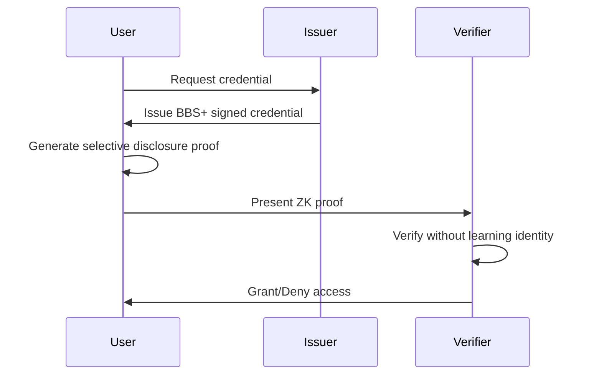

#wiki
#wotcfy
# iamwhoiam DID Protocol
*Wiki Entry | Created: 2025-09-04 | Source: July 2025 Portfolio Documentation*

## Executive Summary
iamwhoiam is a decentralized identity (DID) protocol that enables **zero-knowledge reputation proofs** through BBS+ signatures and SnarkJS circuits. Users can prove claims about their identity and reputation without revealing any actual identifying information.

## Core Technology

### Foundation Stack
```yaml
Identity_Protocol: did:key
Signature_Scheme: BBS+ (BLS12-381)
Proof_System: SnarkJS (Groth16)
Selective_Disclosure: BBS+ native support
Privacy_Level: Zero-knowledge
```

### The Three-Layer Architecture

#### Layer 1: Identity Foundation
- **Self-Sovereign**: Users control their own keys
- **Decentralized**: No central authority required
- **Portable**: Identity works across platforms
- **Persistent**: Cryptographically secured

#### Layer 2: Credential Management  
- **BBS+ Signatures**: Enable selective disclosure
- **Attribute-Based**: Multiple claims per credential
- **Unlinkable**: Different uses can't be correlated
- **Revocable**: Without breaking privacy

#### Layer 3: Zero-Knowledge Proofs
- **Threshold Proofs**: Prove value > X without revealing value
- **Set Membership**: Prove inclusion without revealing which
- **Range Proofs**: Prove value within range
- **Composite Proofs**: Multiple conditions simultaneously

## Technical Implementation

### DID Document Structure
```json
{
  "id": "did:key:zUC7...abc",
  "verificationMethod": [{
    "id": "did:key:zUC7...abc#zUC7...abc",
    "type": "BLS12381G2Key2020",
    "controller": "did:key:zUC7...abc",
    "publicKeyBase58": "..."
  }],
  "authentication": ["did:key:zUC7...abc#zUC7...abc"],
  "assertionMethod": ["did:key:zUC7...abc#zUC7...abc"],
  "capabilityDelegation": ["did:key:zUC7...abc#zUC7...abc"],
  "capabilityInvocation": ["did:key:zUC7...abc#zUC7...abc"]
}
```

### BBS+ Signature Flow


### Zero-Knowledge Circuit
```javascript
// Core reputation threshold circuit
circuit ReputationThreshold() {
  // Private signals (hidden from verifier)
  signal private input reputation;
  signal private input nonce;
  signal private input identity_commitment;
  
  // Public signals (visible to verifier)
  signal input threshold;
  signal input challenge;
  signal output valid;
  
  // Constraint: reputation must exceed threshold
  component gte = GreaterEqualThan(64);
  gte.in[0] <== reputation;
  gte.in[1] <== threshold;
  valid <== gte.out;
  
  // Prevent replay attacks
  signal nonceHash <== Poseidon(nonce);
  nonceHash === challenge;
}
```

## Privacy Features

### Selective Disclosure Capabilities
| What You Can Prove | What Remains Hidden |
|-------------------|---------------------|
| Age > 18 | Exact birthdate |
| Income > $50k | Actual income |
| Reputation > 750 | Exact score |
| Member of group | Which member |
| Owns credential | Identity of owner |

### Unlinkability Guarantees
- **Different Proofs**: Can't be connected to same user
- **Multiple Presentations**: Each is cryptographically unique
- **Cross-Platform**: Usage on one platform doesn't affect another
- **Time-Separated**: Past and future uses uncorrelatable

## Integration Architecture

### With ZMAT Protocol
```yaml
Data_Flow:
  1. ZMAT generates reputation scores
  2. Scores imported into iamwhoiam credentials  
  3. User creates ZK proofs of reputation
  4. Verifier checks without learning identity

Benefits:
  - Portable reputation across platforms
  - Privacy-preserving verification
  - No central reputation authority
  - Sybil-resistant through ZMAT scoring
```

### With WOTCFY Platform
```yaml
Use_Cases:
  - Anonymous job applications
  - Bias-free skill verification
  - Privacy-preserving background checks
  - Reputation-based matching

Integration_Points:
  - Credential issuance for verified skills
  - ZK proofs for application requirements
  - Selective disclosure for interviews
  - Post-hire identity revelation
```

### API Endpoints
```typescript
// Core API structure
interface IamWhoIamAPI {
  // Identity operations
  createDID(): Promise<DIDDocument>
  resolveDID(did: string): Promise<DIDDocument>
  
  // Credential operations
  issueCredential(claims: Claims): Promise<Credential>
  verifyCredential(credential: Credential): Promise<boolean>
  
  // Proof operations
  generateProof(credential: Credential, disclosure: Disclosure): Promise<Proof>
  verifyProof(proof: Proof, challenge: string): Promise<boolean>
  
  // Reputation bridge
  importZMATScore(score: number, signature: string): Promise<Credential>
  proveReputationThreshold(threshold: number): Promise<Proof>
}
```

## Security Model

### Threat Mitigation
| Attack Vector | Defense Mechanism |
|--------------|-------------------|
| Identity theft | Cryptographic key control |
| Credential forgery | BBS+ signature verification |
| Replay attacks | Nonce-based challenges |
| Correlation attacks | Unlinkable proofs |
| Man-in-middle | TLS + proof binding |
| Sybil attacks | ZMAT reputation requirement |

### Cryptographic Primitives
- **BLS12-381**: Pairing-friendly elliptic curve
- **BBS+**: Signature scheme with selective disclosure
- **Poseidon Hash**: ZK-friendly hash function
- **Groth16**: Succinct NIZK proof system

## Implementation Roadmap

### Phase 1: Core Protocol ✅
- [x] did:key implementation
- [x] BBS+ signature library
- [x] Basic ZK circuits
- [x] Proof generation/verification

### Phase 2: Integration Layer 🔄
- [ ] ZMAT score bridge
- [ ] WOTCFY platform connector
- [ ] Universal resolver support
- [ ] Mobile SDK development

### Phase 3: Advanced Features 📋
- [ ] Multi-party computation
- [ ] Cross-chain bridges
- [ ] Attribute-based encryption
- [ ] Homomorphic operations

### Phase 4: Ecosystem 🌐
- [ ] Standards compliance (W3C, DIF)
- [ ] Enterprise connectors
- [ ] Regulatory frameworks
- [ ] Global adoption

## Performance Metrics

### Current Benchmarks
```yaml
Operations:
  DID_Creation: ~50ms
  Credential_Issuance: ~100ms
  BBS_Signature: ~10ms
  Proof_Generation: ~2000ms
  Proof_Verification: ~20ms
  
Storage:
  DID_Document: ~1KB
  Credential: ~2KB  
  ZK_Proof: ~500B
  
Scalability:
  Proofs_per_second: 50
  Verifications_per_second: 5000
  Concurrent_users: 100K+
```

## Business Applications

### Industry Use Cases

#### Financial Services
- KYC without data exposure
- Credit checks without history reveal
- Anonymous transactions with reputation

#### Healthcare
- Age verification for services
- Insurance eligibility proofs
- Medical credential verification

#### Employment
- Anonymous skill verification
- Bias-free application process
- Background check without exposure

#### Social Platforms
- Reputation-gated communities
- Anonymous verified accounts
- Sybil-resistant voting

## Comparison Matrix

### vs. Traditional Identity Systems
| Feature | Traditional | Blockchain-Based | iamwhoiam |
|---------|------------|------------------|-----------|
| Privacy | None | Pseudonymous | Complete |
| Control | Centralized | Distributed | Self-sovereign |
| Portability | Siloed | Limited | Universal |
| Selective Disclosure | No | Minimal | Full |
| Correlation Resistance | None | Weak | Strong |

## Development Resources

### Code Repositories
```yaml
Core_Libraries:
  - github.com/sparkii/iamwhoiam-core
  - github.com/sparkii/bbs-signatures
  - github.com/sparkii/zk-circuits

SDKs:
  - JavaScript/TypeScript
  - Python
  - Rust
  - Go

Documentation:
  - API Reference
  - Integration Guides
  - Security Audits
  - Best Practices
```

### Integration Examples
```javascript
// Simple reputation proof
import { IamWhoIam } from '@sparkii/iamwhoiam';

async function proveHighReputation() {
  const did = await IamWhoIam.createDID();
  const reputation = await IamWhoIam.importZMATScore(850);
  
  // Prove reputation > 750 without revealing actual score
  const proof = await IamWhoIam.proveReputationThreshold(750);
  
  // Verifier learns only that reputation > 750
  const isValid = await IamWhoIam.verifyProof(proof);
  console.log(isValid); // true
}
```

## Research & Innovation

### Active Research Areas
1. **Quantum-resistant signatures** - Post-quantum BBS variants
2. **Threshold credentials** - Multi-authority issuance
3. **Privacy-preserving revocation** - Without correlation
4. **Cross-chain interoperability** - Universal DID resolution

### Academic Collaborations
- Cryptography research groups
- Privacy-enhancing technology labs
- Decentralized identity initiatives
- Zero-knowledge proof communities

## Governance & Standards

### Compliance Frameworks
- **W3C DID**: Core specification compliance
- **DIF**: Decentralized Identity Foundation member
- **GDPR**: Privacy by design principles
- **CCPA**: User control requirements

### Open Standards
- Verifiable Credentials Data Model
- DID Method Specification
- BBS+ Signature Suite
- ZKP Interoperability

## Metrics & KPIs

### Adoption Metrics
```yaml
Target_Metrics:
  Year_1:
    - Active_DIDs: 10,000
    - Daily_proofs: 1,000
    - Integration_partners: 10
    
  Year_2:
    - Active_DIDs: 100,000
    - Daily_proofs: 50,000
    - Integration_partners: 50
    
  Year_3:
    - Active_DIDs: 1,000,000
    - Daily_proofs: 500,000
    - Integration_partners: 200
```

### Success Indicators
- Privacy incidents: 0
- Correlation attacks prevented: 100%
- User satisfaction: >90%
- Developer adoption rate: >50% YoY

## Connection Map

### Internal Connections
- **[ZMAT_Human_Trust_Protocol]** - Reputation source
- **[WOTCFY_Platform]** - Primary use case
- **[Hyper-Focus_Sessions]** - Productivity verification
- **[Knowledge_Vault]** - Credential storage

### External Opportunities
- **Identity Providers** - Migration path
- **Government Services** - Digital ID programs
- **Financial Institutions** - KYC/AML compliance
- **Healthcare Systems** - Patient privacy

## Philosophy & Vision

### The Core Principle
**"Identity is about proving claims, not revealing information."**

### The Paradigm Shift
From: "Show me who you are" → "Prove what I need to know"
From: "Trust requires transparency" → "Trust requires proof"
From: "Privacy OR functionality" → "Privacy AND functionality"

### The Ultimate Goal
Create a world where every human can:
- **Prove anything** without revealing everything
- **Maintain privacy** while building reputation  
- **Control identity** across all platforms
- **Interact freely** without surveillance

---

## Wiki Metadata
```yaml
Status: Active
Category: Identity Protocol
Tags: [DID, zero-knowledge, BBS+, privacy, identity, reputation]
Dependencies: [ZMAT Protocol, SnarkJS, BBS+ Library]
Last_Updated: 2025-09-04
Source_Documentation: Portfolio conversations July 2025
Related_Wikis: [ZMAT_Human_Trust_Protocol]
```

---

*The revolution: In a world demanding ever more data, iamwhoiam enables ever more privacy.*